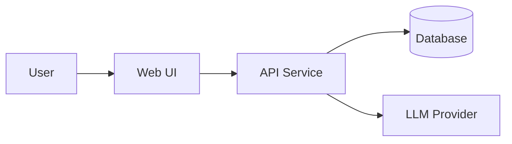
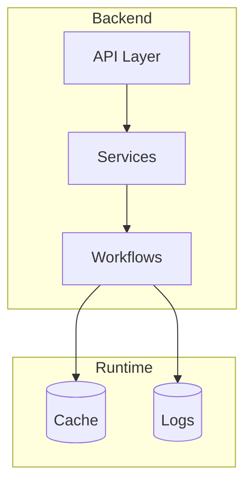
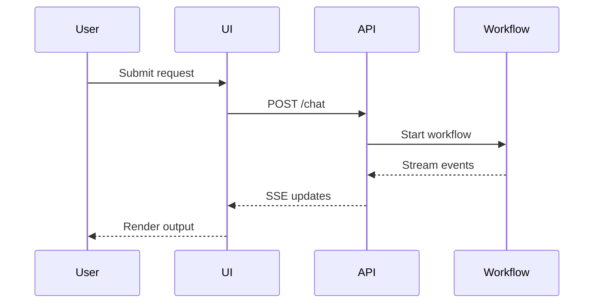
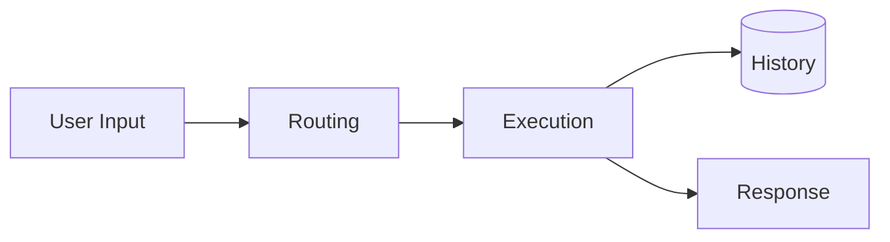
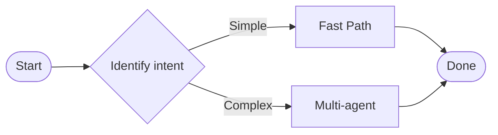
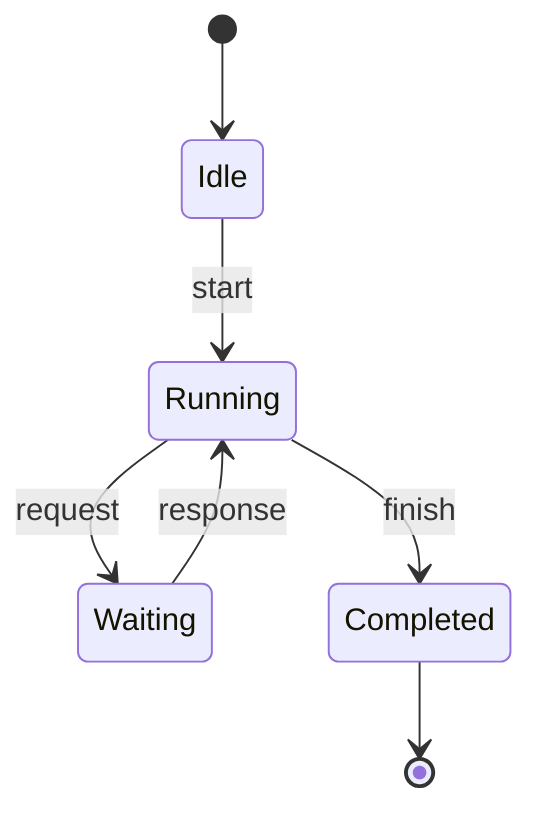

# Diagram Templates (Mermaid)

## Table of Contents

1. System Context
2. Component Diagram
3. Sequence Diagram
4. Data Flow
5. User Flow
6. State Diagram

## Diagram Guidelines

- Prefer Mermaid in Markdown unless the repo uses another tool.
- Keep diagrams small (5-9 nodes) and label edges clearly.
- Align diagrams with actual code or config names.
- Add a 1-2 sentence caption below each diagram.

## 1. System Context

## 2. Component Diagram

## 3. Sequence Diagram

## 4. Data Flow

## 5. User Flow

## 6. State Diagram

