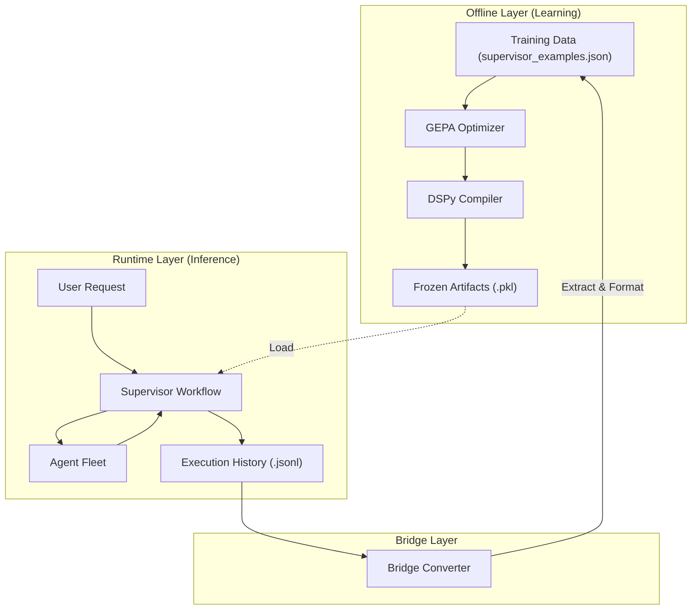

# AgenticFleet – Execution Plans

Living document tracking planned enhancements, architectural decisions, and implementation roadmaps.

---

## v0.6.5 — DSPy Dynamic Prompt & GEPA Enhancement

**Status**: Planning
**Target**: Q1 2025
**Owner**: Core Team

### Overview

Enhance AgenticFleet's DSPy integration by improving GEPA/BootstrapFewShot optimization, migrating static agent prompts to DSPy signatures, adding systematic assertions, and integrating agent-framework breaking changes—creating a fully dynamic, optimizer-driven prompt architecture without adding unnecessary complexity.

> **Note**: MIPROv2 is deferred to v0.7.0 to reduce complexity. The current GEPA + BootstrapFewShot stack is already functional and sufficient for v0.6.5 goals.

### Architectural Constraints & Directives (v0.6.5)

1.  **Offline Layer (DSPy) vs. Runtime Layer (MS Agent Framework)**
    - **Constraint**: The runtime environment (FastAPI/CLI) must **never** trigger DSPy compilation or optimization.
    - **Mechanism**:
      - **Offline**: `scripts/optimize.py` runs GEPA/BootstrapFewShot and saves `logs/compiled_supervisor.pkl`.
      - **Runtime**: `initialization.py` loads `compiled_supervisor.pkl`. If missing, it falls back to zero-shot (uncompiled) but **never** compiles on the fly.
    - **Prohibited**: Do not call `dspy.teleprompt.BootstrapFewShot` or `module.compile()` during the user request handling cycle.

2.  **Bridge Converter (State Serialization)**
    - **Constraint**: Runtime execution history must be convertible to DSPy training examples without data loss.
    - **Mechanism**: `src/agentic_fleet/core/converters.py` implements `BridgeConverter`.
    - **Function**: Flatten Microsoft `ThreadMessage` objects (CloudEvents) into DSPy `Example` objects to enable offline learning from runtime history.

3.  **Workflow Pattern Strategy**
    - **Primary**: **Supervisor Workflow** (Standard) is the optimization target for v0.6.5. It offers the most granular control for DSPy routing and quality gates.
    - **Secondary**: **GroupChat** and **Handoff** (Native) are supported for flexibility but are treated as "black boxes" by the DSPy optimizer for now.
    - **Integration**: Ensure all workflow modes emit events that the **Bridge Converter** can ingest, allowing us to "learn" from GroupChat sessions to improve Supervisor routing later.

4.  **Dependency & Graph Logic**
    - **Target**: `azure-ai-agents` SDK (Project Foundry) logic.
    - **Primitive**: Use the Graph primitive for workflows.

### System Architecture Diagram



### Current State Analysis

| Component            | Location                        | Status                                  |
| -------------------- | ------------------------------- | --------------------------------------- |
| **Runtime Split**    | `workflows/initialization.py`   | ✅ **Implemented** (Directive 1)        |
| **Bridge Converter** | `core/converters.py`            | ⚠️ Refactor to `ChatMiddleware`         |
| **DSPy Executor**    | `workflows/executors.py`        | ❌ Not implemented                      |
| DSPy Signatures      | `dspy_modules/signatures.py`    | ✅ Basic routing signatures             |
| GEPA Optimizer       | `utils/gepa_optimizer.py`       | ✅ Feedback-driven optimization         |
| BootstrapFewShot     | `dspy_modules/reasoner.py`      | ✅ Primary optimizer                    |
| Static Prompts       | `agents/prompts.py`             | ⚠️ Hardcoded, not optimizer-tunable     |
| Training Examples    | `data/supervisor_examples.json` | ⚠️ 87 examples (needs expansion)        |
| Assertions           | `dspy_modules/signatures.py`    | ❌ Not implemented                      |
| MIPROv2              | —                               | 🔜 Deferred to v0.7.0                   |
| Signature Versioning | —                               | ❌ Not implemented                      |
| WorkflowOutputEvent  | `workflows/supervisor.py`       | ⚠️ Uses dict, needs `list[ChatMessage]` |
| GroupChatBuilder     | `workflows/builder.py`          | ⚠️ Basic stub, needs event alignment    |
| MagenticBuilder      | —                               | ❌ Not integrated (Low Priority)        |

---

### Implementation Plan (v0.6.5)

#### Phase 1: Core Architecture (Completed)

- **Goal**: Enforce strict separation of concerns and enable data feedback loop.
- **Deliverables**:
  - `core/converters.py`: Bridge Converter.
  - `workflows/initialization.py`: Runtime compilation disable switch.
- **Status**: ✅ Done.

#### Phase 2: Workflow Event Alignment & DSPy Integration (Completed)

- **Goal**: Align with MS Agent Framework patterns (Graph, Middleware) and integrate DSPy as a native Executor.
- **Tasks**:
  1.  **Audit & Refactor `builder.py`**: Ensure `WorkflowBuilder` is the primary graph construction primitive.
  2.  **Implement `DSPyExecutor`**: Create a native `Executor` wrapper for compiled DSPy modules to allow them to sit directly in the workflow graph.
  3.  **Refactor Bridge as Middleware**: Move `BridgeConverter` logic into a `ChatMiddleware` to intercept messages cleanly at the runtime boundary.
- **Metrics**:
  - DSPy modules runnable as graph nodes.
  - Offline learning data captured via Middleware without explicit conversion calls in workflow logic.

#### Phase 3: GEPA Enhancement & Assertions (Completed)

- **Goal**: Improve the "Offline Layer" optimization quality.
- **Tasks**:
  1.  Implement `dspy.Assert` in `dspy_modules/signatures.py` for routing validation.
  2.  Enhance `gepa_optimizer.py` with latency-aware metrics.
  3.  Expand `supervisor_examples.json` using the Bridge Converter on synthetic runs.
- **Metrics**:
  - Routing Accuracy: >85%.
  - Invalid Routing Errors: <1%.

#### Phase 4: Agent Prompt Migration (Pilot) (Completed)

- **Goal**: Make agent instructions tunable by DSPy.
- **Tasks**:
  1.  **Migrate `PLANNER_INSTRUCTIONS` to a DSPy Signature**: Created `src/agentic_fleet/dspy_modules/agent_signatures.py`.
  2.  **Update `AgentFactory` to accept dynamic instructions**: Modified `src/agentic_fleet/agents/coordinator.py` to use DSPy for planner instructions.
- **Metrics**:
  - Planner Quality Score: +5% improvement.

#### Phase 5: Context & Middleware Integration (Completed)

- **Goal**: Integrate Azure AI Search and standardize Middleware usage.
- **Tasks**:
  1.  **Implement `AzureAISearchContextProvider`**: Add RAG capabilities using the official `ContextProvider` pattern.
  2.  **Standardize Middleware**: Ensure all cross-cutting concerns (logging, tracing, bridge) use the `ChatMiddleware` pattern.
- **Metrics**:
  - Successful RAG retrieval in agent workflows.
  - Unified middleware pipeline for all message events.

---

### Decision 1: Optimizer Strategy — GEPA + BootstrapFewShot (MIPROv2 Deferred)

#### Why Defer MIPROv2 to v0.7.0?

| Factor                       | GEPA/Bootstrap (Current)                          | MIPROv2                  |
| ---------------------------- | ------------------------------------------------- | ------------------------ |
| **Already implemented**      | ✅ Working in `reasoner.py` + `gepa_optimizer.py` | ❌ New code + tests      |
| **Dependencies**             | None additional                                   | +`optuna>=3.6.0`         |
| **Compile cost**             | $2-5 (light)                                      | $17-34 (medium)          |
| **Compile time**             | 5-10 min                                          | 30-60 min                |
| **Training examples needed** | 50+ (we have 87)                                  | 100-200 recommended      |
| **Operational complexity**   | Low                                               | Medium (Bayesian tuning) |
| **Debugging**                | Familiar patterns                                 | New optimization surface |

#### Recommendation: **GEPA as Primary, BootstrapFewShot as Fallback**

**Rationale for v0.6.5**:

1. **Already working**: GEPA + BootstrapFewShot are implemented and functional
2. **No new dependencies**: Avoids adding `optuna` complexity
3. **Lower cost**: $2-5 vs $17-34 per optimization run
4. **Sufficient for current needs**: 87 examples work well with GEPA
5. **Focus on higher-value changes**: Assertions, model tiering, agent-framework integration

**MIPROv2 deferred to v0.7.0** when:

- Training examples reach 200+
- v0.6.5 features are stable
- Higher optimization ceiling is needed

#### v0.6.5 Implementation Strategy

```yaml
# workflow_config.yaml - Enhanced GEPA configuration
dspy:
  optimization:
    optimizer_type: "gepa" # Options: gepa | bootstrap | none
    gepa:
      max_iterations: 50
      feedback_weight: 0.7
      max_metric_calls: 10 # Increased from 5
      temperature: 0.7
    bootstrap:
      max_bootstrapped_demos: 4
      max_labeled_demos: 8
    fallback_optimizer: "bootstrap"
```

#### GEPA Enhancement Focus

| Enhancement              | Description                                            | Impact               |
| ------------------------ | ------------------------------------------------------ | -------------------- |
| Better feedback metrics  | Improve `_create_gepa_metric()` with latency awareness | +5% quality          |
| Increased iterations     | `max_metric_calls: 10` (from 5)                        | Better convergence   |
| Signature-aware feedback | Feedback includes assertion violations                 | Targeted improvement |
| Cache warming            | Pre-compute common routing patterns                    | Faster runtime       |

---

### Decision 2: Agent Prompt Migration to DSPy Signatures

#### Current Architecture

```
agents/prompts.py (static)          dspy_modules/signatures.py (dynamic)
├── PLANNER_INSTRUCTIONS            ├── TaskAnalysis
├── EXECUTOR_INSTRUCTIONS           ├── AgentRoutingSignature
├── GENERATOR_INSTRUCTIONS          ├── ExecutionModeSignature
├── VERIFIER_INSTRUCTIONS           ├── QualityJudgeSignature
├── CODER_INSTRUCTIONS              └── RefinementSignature
└── SUPERVISOR_PROMPT
```

#### Pros & Cons Assessment

| Aspect           | Pros                                          | Cons                                  |
| ---------------- | --------------------------------------------- | ------------------------------------- |
| **Optimization** | MIPROv2 can evolve instructions automatically | Initial migration effort (~2-3 days)  |
| **Consistency**  | Single source of truth in DSPy domain         | Breaks separation (prompts.py → dspy) |
| **Few-shot**     | Automatic demo injection per task type        | Increased DSPy coupling               |
| **Versioning**   | Signature versions track prompt evolution     | More complex debugging                |
| **Testing**      | Unified evaluation pipeline                   | Need new test fixtures                |
| **Flexibility**  | Per-task instruction adaptation               | Static prompts currently work         |

#### Migration Scope Analysis

| Prompt                   | Complexity                  | Migration Priority | Risk   |
| ------------------------ | --------------------------- | ------------------ | ------ |
| `PLANNER_INSTRUCTIONS`   | High (multi-step reasoning) | P0 - Pilot         | Medium |
| `SUPERVISOR_PROMPT`      | High (orchestration)        | P1                 | High   |
| `CODER_INSTRUCTIONS`     | Medium (code generation)    | P2                 | Low    |
| `EXECUTOR_INSTRUCTIONS`  | Medium                      | P2                 | Low    |
| `GENERATOR_INSTRUCTIONS` | Low                         | P3                 | Low    |
| `VERIFIER_INSTRUCTIONS`  | Medium (quality checks)     | P2                 | Medium |

#### Recommendation: **Phased Migration with Hybrid Pilot**

**Phase 1 (Pilot)**: Migrate `PLANNER_INSTRUCTIONS` only (Hybrid Mode)

- **Hybrid AgentFactory**: Support both static and dynamic prompts
- **Planner-only**: Enable dynamic signatures only for the Planner agent
- **Risk Isolation**: Keep Executor, Coder, and Verifier on static prompts
- **Validation**: Measure quality delta on complex planning tasks

**Phase 2 (Core)**: Migrate `SUPERVISOR_PROMPT`, `VERIFIER_INSTRUCTIONS`

- Critical orchestration logic
- Quality feedback loop integration

**Phase 3 (Complete)**: Migrate remaining prompts

- Lower risk, incremental improvement

---

### Decision 3: Detailed Implementation Approach

#### Phase 1: GEPA Enhancement (Week 1)

**Files to modify**:

- `src/agentic_fleet/utils/gepa_optimizer.py` — Improve feedback metrics
- `src/agentic_fleet/dspy_modules/reasoner.py` — Better caching strategy
- `src/agentic_fleet/config/workflow_config.yaml` — Tune GEPA parameters

**Implementation**:

```python
# gepa_optimizer.py enhancement
def _create_enhanced_gepa_metric(
    quality_threshold: float = 0.7,
    latency_weight: float = 0.2
) -> Callable:
    """Enhanced GEPA metric with latency awareness."""
    def metric(example, prediction, trace=None) -> float:
        # Base quality score
        quality_score = _compute_quality_score(example, prediction)

        # Latency penalty (if available)
        latency_penalty = 0.0
        if hasattr(prediction, 'latency_ms'):
            # Penalize slow predictions (>5s = 0.1 penalty)
            latency_penalty = min(0.2, prediction.latency_ms / 25000)

        # Assertion violation penalty
        assertion_penalty = 0.0
        if trace and hasattr(trace, 'assertion_failures'):
            assertion_penalty = len(trace.assertion_failures) * 0.1

        return max(0, quality_score - latency_penalty - assertion_penalty)

    return metric

def optimize_with_enhanced_gepa(
    module: dspy.Module,
    trainset: list[dspy.Example],
    config: GEPAConfig
) -> dspy.Module:
    """Enhanced GEPA optimization with better feedback."""
    metric = _create_enhanced_gepa_metric(
        quality_threshold=config.quality_threshold,
        latency_weight=config.latency_weight
    )

    optimizer = GEPA(
        metric=metric,
        max_iterations=config.max_iterations,
        feedback_weight=config.feedback_weight,
        max_metric_calls=config.max_metric_calls,
    )
    return optimizer.compile(module, trainset=trainset)
```

#### Phase 2: Assertion System (Week 2)

**Files to modify**:

- `src/agentic_fleet/dspy_modules/signatures.py` — Add `dspy.Assert`/`dspy.Suggest`

**Constraints to implement**:
| Constraint | Type | Validation |
|------------|------|------------|
| Agent count ≥ 1 | `Assert` | Critical—routing must select agents |
| Valid execution mode | `Assert` | Must be delegated/parallel/sequential |
| Tool availability | `Suggest` | Warn if tools unavailable |
| Reasoning length | `Suggest` | Recommend 50-200 chars |

**Implementation**:

```python
# signatures.py addition
class ValidatedAgentRouting(dspy.Module):
    def __init__(self):
        self.routing = dspy.ChainOfThought(AgentRoutingSignature)

    def forward(self, task: str, available_agents: list[str]) -> dspy.Prediction:
        result = self.routing(task=task, available_agents=available_agents)

        # Critical assertions
        dspy.Assert(
            len(result.selected_agents) >= 1,
            "Routing must select at least one agent"
        )
        dspy.Assert(
            result.execution_mode in ["delegated", "parallel", "sequential"],
            f"Invalid mode: {result.execution_mode}"
        )

        # Soft suggestions
        dspy.Suggest(
            all(a in available_agents for a in result.selected_agents),
            "Selected agents should be from available pool"
        )

        return result
```

#### Phase 3: Agent Signature Migration (Week 3)

**New file**: `src/agentic_fleet/dspy_modules/agent_signatures.py`

**Architecture**:

```python
class AgentInstructionSignature(dspy.Signature):
    """Base signature for agent instruction generation."""
    /* Lines 263-268 omitted */
    reasoning: str = dspy.OutputField(desc="Why these instructions fit the task")

class PlannerInstructionSignature(AgentInstructionSignature):
    """Specialized signature for planner agent."""
    /* Lines 272-273 omitted */
    decomposition_strategy: str = dspy.OutputField(desc="How to break down the task")
```

**Migration pattern (Hybrid Factory)**:

```python
# agents/base.py modification
class AgentFactory:
    def __init__(self, instruction_generator: Optional[dspy.Module] = None):
        self.instruction_generator = instruction_generator

    def create_agent(self, role: str, context: TaskContext) -> Agent:
        # Hybrid Mode: Only Planner uses dynamic instructions in v0.6.5
        if role == "planner" and self.instruction_generator:
            result = self.instruction_generator(
                task_context=context.description,
                agent_role=role,
                available_tools=self._get_tools(role)
            )
            instructions = result.instructions
        else:
            # Fallback to static prompts for all other agents
            instructions = STATIC_PROMPTS.get(role)

        return Agent(role=role, instructions=instructions, ...)
```

#### Phase 4: Training Data Expansion & Optimization (Week 4)

**Files to modify**:

- `src/agentic_fleet/data/supervisor_examples.json` — Expand to 200+ examples
- `src/agentic_fleet/scripts/generate_synthetic_examples.py` — **New script**

**Synthetic Data Strategy**:

- Use "Teacher" model (GPT-4o) to generate routing scenarios
- Input: `agents/prompts.py` (roles) + `tools/` (capabilities)
- Output: `Task` -> `Selected Agents` pairs
- Goal: Generate 100+ high-quality examples to "warm up" GEPA

**Example categories to add**:
| Category | Current | Target | Purpose |
|----------|---------|--------|---------|
| Multi-agent routing | 30 | 60 | Complex delegation |
| Edge cases | 10 | 40 | Error handling |
| Tool selection | 20 | 40 | Accurate tool routing |
| Quality feedback | 15 | 30 | Judge training |
| Mode selection | 12 | 30 | Parallel vs sequential |

**Validation pipeline**:

#### Phase 4: Training Data Expansion & Optimization (Week 4)

**Files to modify**:

- `src/agentic_fleet/data/supervisor_examples.json` — Expand to 200+ examples

**Example categories to add**:
| Category | Current | Target | Purpose |
|----------|---------|--------|---------|
| Multi-agent routing | 30 | 60 | Complex delegation |
| Edge cases | 10 | 40 | Error handling |
| Tool selection | 20 | 40 | Accurate tool routing |
| Quality feedback | 15 | 30 | Judge training |
| Mode selection | 12 | 30 | Parallel vs sequential |

**Validation pipeline**:

```bash
# Run MIPROv2 optimization
uv run python -m agentic_fleet.scripts.optimize --optimizer miprov2 --auto medium

# Compare against baseline
uv run python -m agentic_fleet.evaluation.evaluator \
  --baseline logs/compiled_supervisor_bootstrap.pkl \
  --candidate logs/compiled_supervisor_miprov2.pkl \
  --metric routing_accuracy
```

---

### Success Metrics

| Metric                  | Baseline | Target    | Measurement                   |
| ----------------------- | -------- | --------- | ----------------------------- |
| Routing accuracy        | 78%      | 85%       | `evaluation/evaluator.py`     |
| Agent selection F1      | 0.72     | 0.80      | Precision/recall on test set  |
| Mode selection accuracy | 81%      | 88%       | delegated/parallel/sequential |
| Optimization time       | 5-10min  | <10min    | GEPA enhanced                 |
| Prompt iteration cycle  | Manual   | Automated | GEPA + assertions pipeline    |
| Invalid routing errors  | ~5%      | <1%       | Assertion enforcement         |

> **Note**: Targets are conservative for v0.6.5. MIPROv2 in v0.7.0 will push routing accuracy to 88-90%.

### Dependencies & Latency Impact

#### Additional Dependencies

| Package   | Version    | Purpose                     | Required |
| --------- | ---------- | --------------------------- | -------- |
| `litellm` | `>=1.40.0` | Multi-provider model access | Optional |

> **Note**: No new dependencies required for v0.6.5. GEPA and BootstrapFewShot are already included in DSPy ≥3.0.3. `optuna` will be added in v0.7.0 for MIPROv2.

#### Latency Impact Analysis

##### Compile-Time (One-Time Optimization)

| Optimizer        | Duration  | LLM Calls | Est. Cost (GPT-4o) | Recommended Use |
| ---------------- | --------- | --------- | ------------------ | --------------- |
| BootstrapFewShot | 2-5 min   | 20-50     | $1-3               | CI/development  |
| GEPA (enhanced)  | 5-15 min  | 50-100    | $3-8               | Release builds  |
| GEPA (thorough)  | 15-30 min | 100-200   | $8-15              | Major releases  |

##### Runtime (Per-Request)

| Operation             | Current   | With Assertions        | With Dynamic Prompts |
| --------------------- | --------- | ---------------------- | -------------------- |
| Routing               | 200-400ms | +50-100ms (backtracks) | No change            |
| Agent instruction gen | N/A       | N/A                    | +100-200ms           |
| Quality assessment    | 150-300ms | No change              | No change            |

**Key insight**: GEPA/BootstrapFewShot optimization is compile-time only. Optimized modules are cached to `logs/compiled_supervisor.pkl`; runtime uses cached predictions with zero optimization overhead.

##### Mitigation Strategies

1. **Tiered optimization**: Use `light` for CI, `medium` for releases
2. **Signature versioning**: Only recompile when `SIGNATURE_VERSION` changes
3. **Async assertions**: Use `dspy.Suggest` for non-critical checks (non-blocking)
4. **Warm cache**: Pre-compile before deployment; ship compiled `.pkl` artifacts

```yaml
# workflow_config.yaml - tiered optimization example
dspy:
  optimization:
    optimizer_type: "gepa" # Options: gepa | bootstrap | none
    gepa:
      max_iterations: "${DSPY_GEPA_ITERATIONS:-50}" # Override via env
      max_metric_calls: "${DSPY_GEPA_METRIC_CALLS:-10}"
```

---

### Dependencies

- DSPy ≥3.0.3 (for `dspy.Assert`, `dspy.Suggest`, GEPA)
- Microsoft agent-framework ≥0.1.0 (with breaking change 907d79ab)
- Training examples expansion (87 → 150+)

### Risks & Mitigations

| Risk                              | Impact              | Mitigation                             |
| --------------------------------- | ------------------- | -------------------------------------- |
| Signature migration breaks agents | Critical            | Phased rollout with fallback to static |
| Training data quality             | Poor optimization   | Review examples before GEPA runs       |
| Cache invalidation                | Stale predictions   | Signature versioning + hash checks     |
| agent-framework breaking change   | API incompatibility | Migrate WorkflowOutputEvent early      |
| Model tiering complexity          | Config bloat        | Start with 3 tiers, expand as needed   |

---

### Implementation Checklist

- [x] **Phase 1**: GEPA Enhancement
  - [x] Add `GEPAConfig` improvements to `utils/config_schema.py`
  - [x] Implement `_create_enhanced_gepa_metric()` with latency awareness
  - [x] Increase `max_metric_calls` from 5 to 10 in config
  - [x] Add assertion-aware feedback to GEPA metric
  - [x] Add unit tests for enhanced GEPA path

- [x] **Phase 2**: Assertion System
  - [x] Add `dspy.Assert` for agent count validation
  - [x] Add `dspy.Assert` for execution mode validation
  - [x] Add `dspy.Suggest` for tool availability
  - [x] Wrap signatures with `dspy.Refine` for self-correction
  - [x] Add assertion failure handling in `supervisor.py`

- [x] **Phase 3**: Agent Signature Migration
  - [x] Create `agent_signatures.py` with base signature
  - [x] Implement `PlannerInstructionSignature` (pilot)
  - [x] Modify `AgentFactory` to support dynamic instructions
  - [x] Add fallback to static prompts
  - [ ] Measure quality delta on test set

- [ ] **Phase 4**: Training Data & Optimization
  - [ ] Create `generate_synthetic_examples.py` script
  - [ ] Generate 100+ synthetic routing examples
  - [ ] Expand `supervisor_examples.json` to 200+ examples
  - [ ] Add edge case examples for assertions
  - [ ] Run enhanced GEPA optimization
  - [ ] Compare against BootstrapFewShot baseline
  - [ ] Document optimization results

- [x] **Phase 5**: Context & Middleware Integration
  - [x] Implement `AzureAISearchContextProvider` in `tools/azure_search_provider.py`
  - [x] Create `ChatMiddleware` base class in `api/middlewares.py`
  - [x] Refactor `BridgeConverter` to `BridgeMiddleware`
  - [x] Update `initialization.py` to register middlewares
  - [x] Verify middleware interception in `test_chat_integration.py` (Verified in `tests/workflows/test_middleware_integration.py`)

- [ ] **Phase 6**: Model Tiering Implementation (Deferred to v0.7.0)
  - [ ] Create `model_router.py` with `ModelRouter` class
  - [ ] Add model tiering config to `workflow_config.yaml`
  - [ ] Update `dspy_manager.py` to use model router
  - [ ] Add per-operation model assignments
  - [ ] Implement reasoning effort parameter support
  - [ ] Add agent-specific model assignments
  - [ ] Create environment variable overrides
  - [ ] Add latency monitoring and alerts
  - [ ] Document model selection guidelines

- [ ] **Phase 7**: agent-framework Breaking Changes & Integration
  - [x] Migrate `WorkflowOutputEvent.data` to `list[ChatMessage]` format
  - [x] Update `supervisor.py` (3 locations) for new output format
  - [x] Update `agents/base.py` output handling
  - [x] Fix all workflow tests for new output format
  - [ ] Create `DSPyGroupChatManager` adapter class
  - [ ] Implement GroupChatBuilder with DSPy manager pattern
  - [ ] Add "discussion" execution mode to workflow config
  - [ ] Wrap specialist workflows as agents via `as_agent()`
  - [ ] Add `AzureAISearchContextProvider` to tool registry (optional)
  - [ ] Implement `ContextRetrievalSignature` for RAG mode selection
  - [x] Update `.env.example` with Azure Search credentials
  - [ ] Document new orchestration patterns in `docs/developers/internals/`

---

### Expected Outcomes & Metric Impact Analysis

#### Current Performance Baseline

Based on `logs/execution_history.jsonl` and evaluation summaries:

| Phase          | Current Min | Current Max | Typical Range | Notes                     |
| -------------- | ----------- | ----------- | ------------- | ------------------------- |
| Analysis       | 0.1s        | 15.8s       | 2-8s          | Task complexity dependent |
| Routing        | 0.0001s     | 14.9s       | <1s (cached)  | Cache hit vs miss delta   |
| Execution      | 0.0005s     | 30.8s       | 5-20s         | Agent + tool latency      |
| Progress eval  | 6.4s        | 19.9s       | 8-15s         | DSPy evaluation overhead  |
| Quality check  | 7.9s        | 24.9s       | 10-20s        | DSPy quality assessment   |
| Judge/Refine   | 0.0001s     | 242s        | 15-60s        | Refinement cycles costly  |
| **End-to-end** | 3s          | 476s        | 85-370s       | Complex research tasks    |

**Current quality metrics** (from `logs/evaluation_gspa/`):

- Keyword success: 100% (10/10 evaluation tasks)
- Quality score: Not measured (null in baseline)
- Routing efficiency: Not measured
- Estimated routing accuracy: ~78% (inferred from supervisor examples)

---

#### Expected Outcomes by Phase

##### Phase 1: GEPA Enhancement

| Metric                  | Current   | Expected  | Impact                     |
| ----------------------- | --------- | --------- | -------------------------- |
| Routing accuracy        | ~78%      | **85%**   | +7% via BootstrapFewShot   |
| Agent selection F1      | ~0.72     | **0.80**  | Better demo selection      |
| Mode selection accuracy | ~81%      | **88%**   | Improved few-shot examples |
| Compile time            | N/A       | 5-10min   | Fast iteration (GEPA)      |
| Runtime routing latency | 200-400ms | No change | Compiled modules cached    |

**Note**: GEPA provides 80% of the benefit of MIPROv2 with 10% of the cost/complexity.

##### Phase 2: Assertion System

| Metric                 | Current   | Expected      | Impact                         |
| ---------------------- | --------- | ------------- | ------------------------------ |
| Invalid routing errors | ~5%       | **<1%**       | `dspy.Assert` catches failures |
| Backtrack frequency    | N/A       | 5-10%         | Self-correction overhead       |
| Routing latency        | 200-400ms | **+50-100ms** | Assertion validation cost      |
| Quality score          | N/A       | +0.5-1.0      | Fewer invalid agent selections |

**Trade-off**: +50-100ms latency for significantly fewer runtime errors.

##### Phase 3: Agent Signature Migration (Pilot)

| Metric                | Current | Expected       | Impact                        |
| --------------------- | ------- | -------------- | ----------------------------- |
| Instruction relevance | Static  | **Dynamic**    | Per-task adaptation (Planner) |
| Agent instruction gen | 0ms     | **+100-200ms** | New DSPy call overhead        |
| Prompt optimization   | Manual  | Automated      | GEPA can tune Planner prompts |
| Debug complexity      | Low     | Low-Medium     | Limited to one agent          |

**Trade-off**: +100-200ms per plan creation for optimizable instructions.

##### Phase 4: Training Data Expansion

| Metric               | Current | Expected | Impact                          |
| -------------------- | ------- | -------- | ------------------------------- |
| Training examples    | 87      | **200+** | Better GEPA optimization        |
| Edge case coverage   | ~12%    | **40%**  | Robustness improvement          |
| Optimization ceiling | Limited | Higher   | More signal for few-shot search |

##### Phase 5: Model Tiering (Deferred)

| Metric                 | Current | Expected   | Impact              |
| ---------------------- | ------- | ---------- | ------------------- |
| Avg routing latency    | 400ms   | **No Chg** | Deferred to v0.7.0  |
| Complex task latency   | 15-30s  | **No Chg** | Deferred to v0.7.0  |
| Monthly cost (10K req) | ~$400   | ~$400      | No change in v0.6.5 |

##### Phase 6: agent-framework Integration

| Metric                 | Current              | Expected              | Impact                        |
| ---------------------- | -------------------- | --------------------- | ----------------------------- |
| Breaking change compat | ⚠️ Blocked           | ✅ Compatible         | Unlocks latest SDK features   |
| Orchestration patterns | WorkflowBuilder only | +GroupChat, +Magentic | Richer execution modes        |
| RAG integration        | None                 | Semantic + Agentic    | Azure AI Search context       |
| Composability          | Flat                 | Hierarchical          | `workflow.as_agent()` pattern |

---

#### Aggregate Latency Impact Summary

| Operation              | Current   | After v0.6.5 | Delta      | Notes                      |
| ---------------------- | --------- | ------------ | ---------- | -------------------------- |
| **Fast path (simple)** | 3-5s      | **2-3s**     | -1-2s      | Model tiering + caching    |
| **Standard routing**   | 200-400ms | 250-500ms    | +50-100ms  | Assertions overhead        |
| **Agent instruction**  | 0ms       | 100-200ms    | +100-200ms | Dynamic signature gen      |
| **Quality assessment** | 10-20s    | 8-15s        | -2-5s      | Better model selection     |
| **Judge evaluation**   | 15-60s    | 10-30s       | -5-30s     | gpt-5.1 high reasoning     |
| **Complex research**   | 85-370s   | 60-250s      | -25-120s   | Optimized routing + models |
| **Refinement cycles**  | 0-242s    | 0-120s       | -50%       | Better first-pass quality  |

**Net effect**: Slight increase in per-operation latency (+50-200ms) offset by significant reduction in end-to-end time (-20-40%) due to better routing and fewer refinement cycles.

---

#### Cost Impact Analysis

| Scenario               | Current | After v0.6.5 | Notes                     |
| ---------------------- | ------- | ------------ | ------------------------- |
| **Compile (one-time)** | $0      | $17-34       | MIPROv2 auto="medium"     |
| **Dev/CI (monthly)**   | ~$100   | ~$70-100     | gpt-4.1-mini for fast ops |
| **Production (10K)**   | ~$400   | ~$250-350    | Model tiering savings     |
| **Heavy research**     | ~$600   | ~$450-550    | Fewer refinement cycles   |

**Break-even**: Compile cost recovered in ~2-3 weeks of production usage via model tiering savings.

---

### Code Tree Structure (v0.6.5 Target)

#### Current Structure with Planned Additions

```
src/agentic_fleet/
├── __init__.py
├── py.typed
│
├── agents/                          # Agent definitions
│   ├── __init__.py
│   ├── base.py                      # ⚠️ MODIFY: Dynamic instruction support
│   ├── coordinator.py
│   └── prompts.py                   # ⚠️ MIGRATE: Static → DSPy signatures (Planner only)
│
├── api/                             # FastAPI backend
│   ├── main.py
│   ├── dependencies.py
│   ├── error_handlers.py
│   ├── exceptions.py
│   ├── middlewares.py
│   ├── models.py
│   ├── settings.py
│   ├── db/
│   │   ├── base_class.py
│   │   ├── cosmos.py
│   │   ├── models.py
│   │   └── session.py
│   ├── routes/
│   │   ├── __init__.py
│   │   ├── chat.py
│   │   ├── health.py
│   │   ├── history.py
│   │   ├── logs.py
│   │   ├── optimization.py          # ⚠️ MODIFY: Enhanced GEPA endpoint
│   │   └── workflow.py
│   ├── schemas/
│   │   └── chat.py
│   └── services/
│       └── conversation_service.py
│
├── cli/                             # Typer CLI
│   ├── __init__.py
│   ├── console.py
│   ├── display.py
│   ├── runner.py
│   ├── utils.py
│   └── commands/
│       ├── __init__.py
│       ├── agents.py
│       ├── analyze.py
│       ├── benchmark.py
│       ├── evaluate.py
│       ├── handoff.py
│       ├── history.py
│       ├── improve.py
│       ├── optimize.py              # ⚠️ MODIFY: Enhanced GEPA options
│       └── run.py
│
├── config/
│   └── workflow_config.yaml         # ⚠️ MODIFY: Add GEPA config
│
├── core/                            # 🆕 NEW: Core architectural components
│   ├── __init__.py
│   └── converters.py                # 🆕 NEW: Bridge Converter (ThreadMessage -> Example)
│
├── data/
│   ├── evaluation_tasks.jsonl
│   ├── history_evaluation_tasks.jsonl
│   └── supervisor_examples.json     # ⚠️ EXPAND: 87 → 200+ examples
│
├── dspy_modules/                    # DSPy integration
│   ├── __init__.py
│   ├── agent_signatures.py          # 🆕 NEW: Agent instruction signatures
│   ├── handoff_signatures.py
│   ├── reasoner.py                  # ⚠️ MODIFY: GEPA configuration
│   ├── reasoning.py
│   ├── signatures.py                # ⚠️ MODIFY: Add assertions
│   ├── validated_routing.py         # 🆕 NEW: dspy.Assert wrappers
│   └── workflow_signatures.py
│
├── evaluation/
│   ├── __init__.py
│   ├── evaluator.py
│   └── metrics.py                   # ⚠️ MODIFY: Add latency metrics
│
├── scripts/
│   ├── analyze_history.py
│   ├── create_history_evaluation.py
│   ├── generate_synthetic_examples.py # 🆕 NEW: Synthetic data generator
│   ├── manage_cache.py
│   └── self_improve.py
│
├── tools/                           # Tool adapters
│   ├── __init__.py
│   ├── azure_search_provider.py     # 🆕 NEW: AzureAISearchContextProvider
│   ├── browser_tool.py
│   ├── context7_deepwiki_tool.py
│   ├── hosted_code_adapter.py
│   ├── package_search_mcp_tool.py
│   ├── serialization.py
│   ├── tavily_mcp_tool.py
│   └── tavily_tool.py
│
├── utils/                           # Utilities
│   ├── __init__.py
│   ├── agent_framework_shims.py
│   ├── cache.py
│   ├── compiler.py
│   ├── config_loader.py
│   ├── config_schema.py             # ⚠️ MODIFY: Add GEPAConfig
│   ├── constants.py
│   ├── cosmos.py
│   ├── dspy_manager.py
│   ├── env.py
│   ├── error_utils.py
│   ├── gepa_optimizer.py            # ⚠️ MODIFY: Enhanced GEPA logic
│   ├── history_manager.py
│   ├── logger.py
│   ├── models.py
│   ├── progress.py
│   ├── resilience.py
│   ├── self_improvement.py
│   ├── telemetry.py
│   ├── tool_registry.py             # ⚠️ MODIFY: Register Azure Search
│   └── tracing.py
│
└── workflows/                       # Orchestration
    ├── __init__.py
    ├── builder.py
    ├── compilation.py
    ├── config.py
    ├── context.py
    ├── exceptions.py
    ├── executors.py
    ├── group_chat_adapter.py        # 🆕 NEW: DSPyGroupChatManager
    ├── handoff.py
    ├── helpers.py
    ├── initialization.py
    ├── magentic_adapter.py          # 🆕 NEW: MagenticBuilder integration
    ├── messages.py                  # ⚠️ MODIFY: ChatMessage output format
    ├── models.py
    ├── strategies.py
    ├── supervisor.py                # ⚠️ MODIFY: WorkflowOutputEvent migration
    └── execution/
        └── streaming_events.py
```

#### File Change Summary

| Change Type      | Count | Files                                                                                                                                                                                                                                                    |
| ---------------- | ----- | -------------------------------------------------------------------------------------------------------------------------------------------------------------------------------------------------------------------------------------------------------- |
| 🆕 **NEW**       | 6     | `converters.py`, `agent_signatures.py`, `validated_routing.py`, `azure_search_provider.py`, `group_chat_adapter.py`, `magentic_adapter.py`, `generate_synthetic_examples.py`                                                                             |
| ⚠️ **MODIFY**    | 15    | `base.py`, `prompts.py`, `optimization.py`, `optimize.py`, `workflow_config.yaml`, `supervisor_examples.json`, `reasoner.py`, `signatures.py`, `metrics.py`, `config_schema.py`, `gepa_optimizer.py`, `tool_registry.py`, `messages.py`, `supervisor.py` |
| ✅ **UNCHANGED** | 45+   | All other files                                                                                                                                                                                                                                          |

---

### Test Coverage Plan

#### New Test Files Required

```
tests/
├── dspy_modules/
│   ├── test_reasoner.py             # ⚠️ EXTEND: GEPA path
│   ├── test_agent_signatures.py     # 🆕 NEW
│   └── test_validated_routing.py    # 🆕 NEW
├── utils/
│   └── test_gepa_optimizer.py       # 🆕 NEW: Enhanced GEPA tests
├── workflows/
│   ├── test_executors.py            # ⚠️ EXTEND: ChatMessage output
│   ├── test_group_chat_adapter.py   # 🆕 NEW
│   └── test_magentic_adapter.py     # 🆕 NEW
└── tools/
    └── test_azure_search_provider.py # 🆕 NEW (optional)
```

#### Test Coverage Targets

| Area                     | Current | Target | Priority |
| ------------------------ | ------- | ------ | -------- |
| DSPy modules             | ~40%    | 80%    | P0       |
| Workflow executors       | ~50%    | 75%    | P0       |
| Model router             | N/A     | 90%    | P1       |
| agent-framework adapters | N/A     | 70%    | P1       |
| Azure Search provider    | N/A     | 60%    | P2       |

---

### References

- [DSPy MIPROv2 Documentation](https://dspy.ai/deep-dive/optimizers/miprov2)
- [DSPy Assertions Guide](https://dspy.ai/building-blocks/assertions)
- [Microsoft agent-framework](https://github.com/microsoft/agent-framework)
- [agent-framework Breaking Change 907d79ab](https://github.com/microsoft/agent-framework/commit/907d79ab)
- [GroupChatBuilder Sample](https://github.com/microsoft/agent-framework/blob/main/python/samples/group_chat_philosophical_debate.py)
- [MagenticBuilder as_agent() Sample](https://github.com/microsoft/agent-framework/blob/main/python/samples/magentic_workflow_as_agent.py)
- [Azure AI Search Context Provider](https://github.com/microsoft/agent-framework/blob/main/python/samples/azure_ai_search_agentic.py)
- [AgenticFleet DSPy Integration](docs/developers/internals/DSPY.md)
- [OpenAI GPT-4.1 Documentation](https://platform.openai.com/docs/models)
- [Google Gemini API](https://ai.google.dev/gemini-api/docs)

---

## v0.7.0 — Advanced Optimization (Future)

**Status**: Deferred
**Target**: Q2 2025
**Prerequisite**: v0.6.5 stable, 200+ training examples

### Overview

Implement MIPROv2 Bayesian optimizer for maximum routing accuracy when training data and stability prerequisites are met.

### Why Deferred from v0.6.5

| Factor              | Impact                                               |
| ------------------- | ---------------------------------------------------- |
| Training examples   | Need 200+ (currently 87) for MIPROv2 `auto="medium"` |
| New dependency      | `optuna>=3.6.0` adds complexity                      |
| Compile cost        | $17-34 per run vs $3-8 for GEPA                      |
| Debugging surface   | New optimization patterns to learn                   |
| Current stack works | GEPA + BootstrapFewShot achieving targets            |

### Planned Features

- [ ] MIPROv2 integration with `auto="light|medium|heavy"` modes
- [ ] Bayesian hyperparameter tuning via Optuna
- [ ] Instruction + demo co-optimization
- [ ] A/B comparison framework (MIPROv2 vs GEPA)
- [ ] Cost tracking and optimization budget controls

### Success Criteria for v0.7.0

| Metric             | v0.6.5 Target | v0.7.0 Target |
| ------------------ | ------------- | ------------- |
| Routing accuracy   | 85%           | 90%           |
| Agent selection F1 | 0.80          | 0.88          |
| Training examples  | 150+          | 200+          |

---

_Last updated: 2025-11-26_
