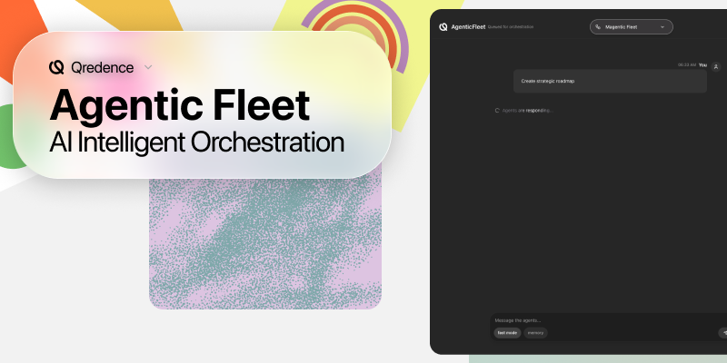
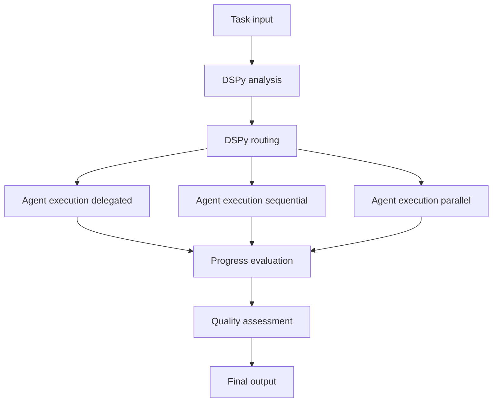

[](./LICENSE)
[](https://pepy.tech/projects/agentic-fleet)
[](https://deepwiki.com/qredence/agentic-fleet)

> **⚠️ Active Development Notice**
> APIs, signatures, and execution semantics can change between minor versions. Pin a version tag for production usage.

---

# AgenticFleet – DSPy‑Enhanced Multi‑Agent Orchestration

AgenticFleet is a hybrid **DSPy + Microsoft agent-framework** runtime that delivers a self‑optimizing fleet of specialized AI agents. DSPy handles task analysis, routing, progress & quality assessment; agent-framework provides robust orchestration primitives, event streaming, and tool execution. Together they enable delegated, sequential, parallel, discussion, and handoff‑driven workflows with iterative refinement loops.

---

## Table of Contents

- [AgenticFleet – DSPy‑Enhanced Multi‑Agent Orchestration](#agenticfleet--dspyenhanced-multiagent-orchestration)
  - [Table of Contents](#table-of-contents)
  - [Key Features](#key-features)
  - [Architecture Overview](#architecture-overview)
    - [Workflow Diagram](#workflow-diagram)
    - [Latency \& Slow Phases](#latency--slow-phases)
    - [Backend API \& Performance](#backend-api--performance)
  - [Directory Layout](#directory-layout)
  - [Installation](#installation)
    - [Python (uv recommended)](#python-uv-recommended)
    - [Standard pip](#standard-pip)
    - [Optional Frontend](#optional-frontend)
    - [Playwright (Browser Tool)](#playwright-browser-tool)
  - [Configuration \& Environment](#configuration--environment)
    - [Quick Start](#quick-start)
      - [TUI / CLI](#tui--cli)
    - [Python API](#python-api)
    - [Backend API](#backend-api)
    - [Streaming](#streaming)
  - [Execution Modes](#execution-modes)
  - [Agents](#agents)
  - [DSPy Optimization](#dspy-optimization)
  - [Observability \& History](#observability--history)
  - [Evaluation \& Self-Improvement](#evaluation--self-improvement)
  - [Testing \& Quality](#testing--quality)
  - [Troubleshooting](#troubleshooting)
  - [Contributing](#contributing)
  - [License](#license)
  - [Acknowledgments](#acknowledgments)
  - [Related Documentation](#related-documentation)

---

## Key Features

- **Adaptive Routing** – DSPy reasoner analyzes tasks and decides agent roster + execution mode (delegated / sequential / parallel / discussion).
- **Group Chat** – Multi-turn, multi-agent discussions orchestrated by `DSPyGroupChatManager` with dynamic speaker selection.
- **Advanced Reasoning** – Pluggable strategies per agent: **ReAct** for autonomous tool loops (Researcher) and **Program of Thought** for code-based logic (Analyst).
- **Quality Loops** – Automatic Judge / Reviewer refinement when quality score drops below configurable threshold.
- **Tool‑Aware Decisions** – Signatures include tool context; Reasoner recommends tool usage (code interpreter, search, browser, etc.).
- **Streaming Events** – Emits OpenAI Responses‑compatible events for real‑time TUI / web UI updates.
- **Self‑Improvement** – GEPA + BootstrapFewShot compilation refines routing from curated examples & execution history.
- **YAML‑Driven** – Central `workflow_config.yaml` governs models, thresholds, agents, tracing, evaluation toggles.
- **Rich Ergonomics** – Typer CLI (`cli/console.py`), `dspy-fleet` command, optional Vite frontend, history analytics scripts.
- **Safe Fallbacks** – Graceful degradation when DSPy unavailable (heuristic routing & quality scoring).
- **Extensible Toolkit** – Add agents, tools, signatures, evaluation metrics with minimal boilerplate.
- **Azure Cosmos DB Persistence (optional)** – Set one flag to mirror workflow runs, agent memories, DSPy datasets, and cache metadata into Cosmos NoSQL for durable, queryable telemetry.

---

## Architecture Overview

Five‑phase pipeline (optimized in v0.6.6):

```
Task → [1] DSPy Analysis → [2] DSPy Routing → [3] Agent Execution → [4] Progress Eval → [5] Quality Assessment → Final Output
```

| Phase     | Responsibility                            | Source                                           |
| --------- | ----------------------------------------- | ------------------------------------------------ |
| Analysis  | Extract goals, complexity, constraints    | `dspy_modules/reasoner.py` (`analyze_task`)      |
| Routing   | Pick agents + execution mode, tools       | `dspy_modules/reasoner.py` (`route_task`)        |
| Execution | Orchestrate agents & tools; stream events | `workflows/supervisor.py`                        |
| Progress  | Evaluate progress, decide next steps      | `dspy_modules/reasoner.py` (`evaluate_progress`) |
| Quality   | Score output, recommend improvements      | `dspy_modules/reasoner.py` (`assess_quality`)    |

### Workflow Diagram



> **Note**: The Judge/Refinement phase was removed in v0.6.6 for ~66% latency improvement. Quality assessment via `QualityAssessment` signature is retained.

Consult: `docs/developers/architecture.md` & `docs/guides/quick-reference.md`.

### Latency & Slow Phases

Common bottlenecks and how to mitigate:

- DSPy compilation on first run
  - Use cached compiled reasoner after first run; clear via `uv run python -m agentic_fleet.scripts.manage_cache --clear`
  - Reduce GEPA effort in `config/workflow_config.yaml` (e.g., `gepa_max_metric_calls`, `max_bootstrapped_demos`)
  - Set `DSPY_COMPILE=false` during rapid iteration
- External tool calls (OpenAI, Tavily, Hosted Interpreter)
  - Prefer lighter Reasoner model `dspy.model: gpt-5-mini`
  - Disable pre‑analysis tool usage for simple tasks
- **Judge/refinement loops (DISABLED by default in v0.6.6)**
  - Judge phase removed from default pipeline for ~66% latency reduction
  - Re-enable with `quality.enable_judge: true` if needed
- Parallel fan‑out synthesis
  - Cap `execution.max_parallel_agents` to a small number
  - Enable streaming to surface progress early
- History and tracing I/O
  - Reduce verbosity in production; batch writes if needed

For timing analysis, run history analytics: `uv run python src/agentic_fleet/scripts/analyze_history.py --timing`.

### Backend API & Performance

Recent optimizations have significantly improved the responsiveness and scalability of the backend API:

- **Non-Blocking Architecture:** Heavy background tasks, such as self-improvement analysis and DSPy compilation, are now offloaded to separate threads. This prevents blocking the main asyncio event loop, ensuring the API remains responsive to new requests even under load.
- **Job Store Abstraction:** Background job state is no longer tied to a global variable. A pluggable `JobStore` interface (currently implemented as `InMemoryJobStore`) allows for easy future extension to persistent stores like Redis or Azure Cosmos DB.
- **Performance Benchmarking:** A dedicated benchmark script (`scripts/benchmark_api.py`) is available to rigorously measure API latency, throughput, and error rates under concurrent load.
- **Real Models Only:** DSPy now requires a real model ID (e.g., `gpt-5-mini`); the previous `test-model`/DummyLM path has been removed to avoid mock outputs during production runs.

---

## Directory Layout

| Path                               | Purpose                                                                        |
| ---------------------------------- | ------------------------------------------------------------------------------ |
| `config/workflow_config.yaml`      | Models, agents, thresholds, tracing, evaluation flags                          |
| `src/agentic_fleet/dspy_modules/`  | DSPy Signatures & Reasoner implementation                                      |
| `src/agentic_fleet/workflows/`     | Flattened orchestration logic (`supervisor.py`, `handoff.py`, `strategies.py`) |
| `src/agentic_fleet/agents/`        | Specialist configurations, factory, and prompts (`prompts.py`)                 |
| `src/agentic_fleet/api/`           | FastAPI backend, DB models (`api/db`), settings (`api/settings.py`)            |
| `src/agentic_fleet/tools/`         | Tool adapters: Tavily, Browser, Hosted Interpreter, MCP                        |
| `src/agentic_fleet/utils/`         | Compiler cache, GEPA optimizer, history, tracing, registry                     |
| `src/agentic_fleet/evaluation/`    | Metrics & evaluator engine                                                     |
| `src/agentic_fleet/cli/console.py` | Rich / Typer CLI (dspy-fleet)                                                  |
| `src/frontend/`                    | Optional Vite + React streaming UI                                             |
| `examples/`                        | Minimal workflow samples                                                       |
| `scripts/`                         | Analysis, self-improvement, benchmarking, dataset gen                          |
| `logs/`                            | Execution history, compilation artifacts                                       |
| `docs/`                            | Documentation (users/, developers/, guides/)                                   |

---

## Installation

### Python (uv recommended)

```bash
git clone https://github.com/Qredence/agentic-fleet.git
cd agentic-fleet

# Create and sync a local environment from pyproject.toml
uv sync
```

### Standard pip

```bash
# From PyPI (library / CLI usage)
pip install agentic-fleet

# From a local clone (editable install)
pip install -e .
```

### Optional Frontend

```bash
make frontend-install          # installs Node dependencies
make dev                       # runs backend + frontend dev servers
```

### Playwright (Browser Tool)

```bash
playwright install chromium
```

---

## Configuration & Environment

Create `.env` (or copy `.env.example`):

```bash
OPENAI_API_KEY=sk-...
# Required for all model calls (validated at startup)
TAVILY_API_KEY=tvly-...
# Optional: Enables web search for Researcher agent
DSPY_COMPILE=true              # Toggle DSPy compilation (true/false)
OPENAI_BASE_URL=https://...
# Optional custom endpoint
LANGFUSE_PUBLIC_KEY=...
LANGFUSE_SECRET_KEY=...

# Optional Azure Cosmos DB mirroring
AGENTICFLEET_USE_COSMOS=0
AZURE_COSMOS_ENDPOINT=https://<account>.documents.azure.com:443/
AZURE_COSMOS_USE_MANAGED_IDENTITY=0
AZURE_COSMOS_KEY=<primary-or-secondary-key>
AZURE_COSMOS_DATABASE=agentic-fleet
AGENTICFLEET_DEFAULT_USER_ID=local-dev
# Container overrides (use defaults unless you renamed them)
# AZURE_COSMOS_WORKFLOW_RUNS_CONTAINER=workflowRuns
# AZURE_COSMOS_AGENT_MEMORY_CONTAINER=agentMemory
# AZURE_COSMOS_DSPY_EXAMPLES_CONTAINER=dspyExamples
# AZURE_COSMOS_DSPY_OPTIMIZATION_RUNS_CONTAINER=dspyOptimizationRuns
# AZURE_COSMOS_CACHE_CONTAINER=cache
```

**Note**: The `OPENAI_API_KEY` environment variable is required and will be validated at startup. If missing, the application will fail with a clear error message.

Key YAML knobs (`workflow_config.yaml`):

- `dspy.model` – Reasoner model (e.g. gpt-5-mini)
- `dspy.optimization.metric_threshold` – Minimum routing accuracy
- `workflow.supervisor.max_rounds` – Conversation turn limit
- `workflow.supervisor.enable_streaming` – Event streaming toggle
- `agents.*` – Per-agent model + temperature + tools
- `evaluation.*` – Batch evaluation settings

**Configuration Validation**: The YAML configuration is automatically validated against a schema when loaded. Invalid values (e.g., out-of-range temperatures, invalid model names) will raise `ConfigurationError` with clear messages indicating which field failed validation. Cosmos mirroring is best-effort—if environment variables are missing or the containers are unreachable, workflows continue locally and you’ll see a warning in the logs.

---

### Quick Start

#### TUI / CLI

```bash
agentic-fleet                       # Launch interactive console (packaged entry point)

# Process a single task (Auto-mode detects best workflow)
agentic-fleet run -m "What is Gemini 3 Pro?" --verbose

# Explicitly use Handoff mode for fast research
agentic-fleet run -m "Who won the NY mayoral race?" --mode handoff

# List available agents and their tools
agentic-fleet list-agents

# Run batch evaluation (uses config dataset by default)
agentic-fleet evaluate --max-tasks 5
```

### Python API

```python
import asyncio
from agentic_fleet.workflows import create_supervisor_workflow

async def main():
		# Auto-mode is default in CLI, for API specify if needed or use default 'standard'
		workflow = await create_supervisor_workflow(compile_dspy=True, mode="standard")
		result = await workflow.run("Summarize transformer architecture evolution")
		print(result["result"])  # final output
		print(result["quality"]) # quality assessment details

asyncio.run(main())
```

### Backend API

Start the FastAPI backend server:

```bash
./scripts/start_backend.sh
# Server runs at http://localhost:8000
# API Docs: http://localhost:8000/api/docs
```

### Streaming

```python
async for event in workflow.run_stream("Compare AWS vs Azure AI offerings"):
		# Handle MagenticAgentMessageEvent / WorkflowOutputEvent
		print(event)
```

---

## Execution Modes

| Mode       | Description                                          | Use Case                               |
| ---------- | ---------------------------------------------------- | -------------------------------------- |
| **Auto**   | **Default.** DSPy analyzes task to pick best mode.   | General usage.                         |
| Delegated  | Single agent manages entire task                     | Focused research, simple writeups      |
| Sequential | Output of one feeds next                             | Research → Analyze → Write report      |
| Parallel   | Multiple agents concurrently; synthesis afterwards   | Multi‑source comparisons               |
| Handoff    | Collaborative graph with direct agent handoffs       | Fast research, linear specialist flows |
| Discussion | Multi-turn group chat with dynamic speaker selection | Brainstorming, complex problem solving |

Reasoner chooses based on task structure + examples; can be overridden via configuration or explicit flags.

---

## Agents

Core specialists: Researcher, Analyst, Writer, Reviewer, Judge (quality). Extended handoff specialists: Planner, Executor, Coder, Verifier, Generator.

See **[AGENTS.md](docs/AGENTS.md)** for detailed roles, tool usage, configuration examples, and selection guidelines.

---

## DSPy Optimization

Training examples live in `src/agentic_fleet/data/supervisor_examples.json`:

```json
{
  "task": "Research the latest AI advances",
  "team": "Researcher: web search\nAnalyst: code + data",
  "assigned_to": "Researcher,Analyst",
  "mode": "sequential"
}
```

Compilation (BootstrapFewShot + GEPA) occurs on first run (if `DSPY_COMPILE=true`). Cache stored under `logs/compiled_supervisor.pkl`. Refresh via:

```bash
uv run python -m agentic_fleet.scripts.manage_cache --clear
```

---

## Observability & History

- **History**: Structured events appended to `logs/execution_history.jsonl`.
- **Tracing**: Enable OpenTelemetry in YAML; export to AI Toolkit / OTLP endpoint.
- **Logging**: Adjustable log level via env (`AGENTIC_FLEET_LOG_LEVEL=DEBUG`).
- **Analysis**: `scripts/analyze_history.py --all` surfaces aggregate metrics.

---

## Evaluation & Self-Improvement

Run batch evaluations against curated tasks:

```bash
uv run python -m agentic_fleet.cli.console analyze --dataset data/evaluation_tasks.jsonl
```

Generate evaluation datasets from history:

```bash
uv run python scripts/create_history_evaluation.py
```

Self‑improve routing by folding high‑quality history examples back into DSPy training:

```bash
uv run python scripts/self_improve.py --max 50
```

---

## Testing & Quality

```bash
make check                 # lint + format (Ruff), type‑check (ty)
make test                  # run pytest suite
PYTHONPATH=. uv run pytest tests/workflows/test_execution_strategies.py -q
```

Key test domains: routing accuracy, tool registry integration, judge refinement, lazy compilation, tracing hooks.

---

## Troubleshooting

| Symptom                | Cause                    | Fix                                                                       |
| ---------------------- | ------------------------ | ------------------------------------------------------------------------- |
| Missing web citations  | `TAVILY_API_KEY` unset   | Export key or set in `.env`                                               |
| Workflow startup fails | Missing `OPENAI_API_KEY` | Set `OPENAI_API_KEY` in `.env` or environment                             |
| Configuration error    | Invalid YAML values      | Check `workflow_config.yaml` for invalid values (e.g., temperature > 2.0) |
| Slow first run         | DSPy compilation         | Enable cache; reduce `max_bootstrapped_demos`                             |
| No streaming output    | `enable_streaming=false` | Toggle in YAML                                                            |
| Low quality score      | Insufficient examples    | Add training examples; rerun compilation                                  |
| Tool warning           | Name mismatch            | Verify tool name & registry entry                                         |

Detailed guides: `docs/users/troubleshooting.md`, `docs/guides/dspy-optimizer.md`.

---

## Contributing

1. Fork / branch (`breaking-refactor` for large changes)
2. Add or update tests (prefer focused unit tests over broad integration when possible)
3. Run `make check` and ensure no style / type errors
4. Update docs (README, AGENTS.md, or relevant guide) for user‑visible changes
5. Submit PR with clear rationale & architectural notes (link to `docs/developers/architecture.md` sections if modifying internals)

Please see: `docs/developers/contributing.md`.

---

## License

MIT License – see [LICENSE](LICENSE).

---

## Acknowledgments

- **Microsoft agent-framework** – Orchestration, events & tool interfaces
- **DSPy (Stanford NLP)** – Prompt optimization & structured signatures
- **Tavily** – Reliable, citation‑rich web search
- **OpenAI Responses** – Event paradigm enabling unified CLI/TUI/frontend streaming

---

## Related Documentation

- Getting Started: `docs/users/getting-started.md`
- Configuration: `docs/users/configuration.md`
- Architecture Deep Dive: `docs/developers/architecture.md`
- Quick Reference: `docs/guides/quick-reference.md`
- DSPy Optimization: `docs/guides/dspy-optimizer.md`
- Evaluation: `docs/guides/evaluation.md`
- Tracing: `docs/guides/tracing.md`
- Self Improvement: `docs/users/self-improvement.md`
- Troubleshooting: `docs/users/troubleshooting.md`
- Cosmos Requirements: `docs/developers/cosmosdb_requirements.md`
- Cosmos Data Model: `docs/developers/cosmosdb_data_model.md`

---

Happy hacking! 🚀
