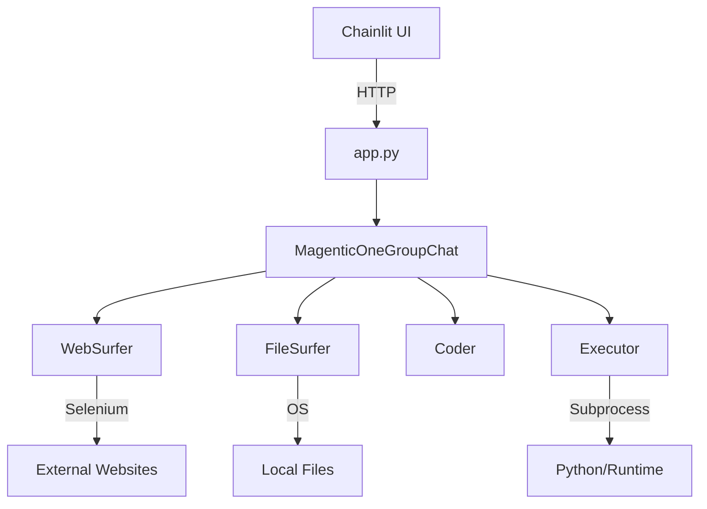

# AgenticFleet

A powerful multi-agent system for adaptive AI reasoning and automation. AgenticFleet combines Chainlit's interactive interface with AutoGen's multi-agent capabilities to create a flexible, powerful AI assistant platform.


[](https://app.codacy.com/gh/Qredence/AgenticFleet/dashboard?utm_source=gh&utm_medium=referral&utm_content=&utm_campaign=Badge_grade)


## Installation Guide

### Prerequisites

- **Python Version:** 3.10-3.12
- **Operating Systems:** macOS, Linux, Windows

### 1. Install `uv` Package Manager

#### macOS/Linux
```bash
# Using pip
pip install uv

# Using homebrew (macOS)
brew install uv

# Using curl
curl -LsSf https://astral.sh/uv/install.sh | sh
```

#### Windows
```powershell
# Using pip
pip install uv

# Using winget
winget install uv
```

### 2. Create a Virtual Environment

```bash
# Create a new virtual environment
uv venv

# Activate the virtual environment
# On macOS/Linux
source .venv/bin/activate

# On Windows
.venv\Scripts\activate
```

### 3. Install AgenticFleet

```bash
# Install the latest stable version
uv pip install agentic-fleet

# Install with specific optional features
uv pip install 'agentic-fleet[telemetry]'
uv pip install 'agentic-fleet[tracing]'

# Install Playwright for web automation and scraping
uv pip install playwright
playwright install --with-deps chromium  # Install Chromium browser and dependencies
```

#### Playwright Installation Notes
- Installs Chromium browser for web automation
- Includes necessary browser dependencies
- Required for web scraping and browser-based agents
- Supports headless and headed browser modes

### 4. Verify Installation

```bash
# Check installed version
uv pip show agentic-fleet

# Run a quick test
python -c "import agentic_fleet; print(agentic_fleet.__version__)"
```

### Troubleshooting

- Ensure you're using Python 3.10-3.12
- Update `uv` to the latest version: `pip install -U uv`
- If you encounter issues, check our [GitHub Issues](https://github.com/Qredence/AgenticFleet/issues)

### Best Practices

- Always use a virtual environment
- Keep `uv` updated
- Use optional feature sets as needed
- Report any installation issues on GitHub

### Optional Feature Sets
```bash
# Install with specific optional features
uv pip install 'agentic-fleet[telemetry]'
uv pip install 'agentic-fleet[tracing]'
```

### ⚠️ Warning About Editable Installations

**DO NOT use `-e` unless you are a core contributor.**

Editable installations:
- Are NOT supported in production
- May introduce unexpected behaviors
- Void package support and warranty
- Are intended ONLY for package development

If you modify the package locally:
1. Open a GitHub issue
2. Submit a pull request
3. Discuss proposed changes with maintainers

Unauthorized local modifications are strongly discouraged.

## Quick Start with Docker

```bash
# Pull the latest image
docker pull qredence/agenticfleet:latest

# Run with minimum required configuration
docker run -d -p 8001:8001 qredence/agenticfleet:latest

# Or run with additional configuration
docker run -d -p 8001:8001 \
  -e AZURE_OPENAI_API_KEY=your_key \
  -e AZURE_OPENAI_ENDPOINT=your_endpoint \
  -e AZURE_OPENAI_DEPLOYMENT=your_deployment \
  -e AZURE_OPENAI_MODEL=your_model \
  -e USE_OAUTH=true \
  -e OAUTH_GITHUB_CLIENT_ID=your_client_id \
  -e OAUTH_GITHUB_CLIENT_SECRET=your_client_secret \
  qredence/agenticfleet:latest

# Run without OAuth
docker run -d -p 8001:8001 \
  -e AZURE_OPENAI_API_KEY=your_key \
  -e AZURE_OPENAI_ENDPOINT=your_endpoint \
  -e USE_OAUTH=false \
  qredence/agenticfleet:latest
```

## Core Components

AgenticFleet operates through a coordinated team of specialized agents:

- **WebSurfer**: Expert web navigation agent
  - Extracts information from web pages
  - Captures and processes screenshots
  - Provides structured summaries of findings

- **FileSurfer**: File system specialist
  - Searches and analyzes workspace files
  - Manages file operations efficiently
  - Extracts relevant information from documents

- **Coder**: Development expert
  - Generates and reviews code
  - Implements solutions
  - Maintains code quality

- **Executor**: Code execution specialist
  - Safely runs code in isolated workspace
  - Monitors execution and handles timeouts
  - Provides detailed execution feedback

## Model Provider Installation

Install providers using pip:

```bash
# Install base package
pip install agentic-fleet
```

## Supported Model Providers

AgenticFleet supports multiple LLM providers through a unified interface:

- **OpenAI**
  - GPT-4 and other OpenAI models
  - Function calling and vision capabilities
  - JSON mode support

- **Azure OpenAI**
  - Azure-hosted OpenAI models
  - Azure AD authentication support
  - Enterprise-grade security

- **Google Gemini**
  - Gemini Pro and Ultra models
  - OpenAI-compatible API
  - Multimodal capabilities

- **DeepSeek**
  - DeepSeek's language models
  - OpenAI-compatible API
  - Specialized model capabilities

- **Ollama**
  - Local model deployment
  - Various open-source models
  - Offline capabilities

- **Azure AI Foundry**
  - Azure-hosted models (e.g., Phi-4)
  - GitHub authentication
  - Enterprise integration

- **CogCache**
  - OpenAI-compatible API with caching
  - Improved response times
  - Cost optimization
  - Automatic retry handling

## Key Features

- **Advanced Capabilities**
  - Multiple LLM provider support
  - GitHub OAuth authentication
  - Configurable agent behaviors
  - Comprehensive error handling and recovery
  - Multi-modal content processing (text, images)
  - Execution workspace isolation
  
- **Developer-Friendly**
  - Easy-to-use CLI
  - Extensive documentation
  - Flexible configuration
  - Active community support

## System Architecture



## Configuration

The `.env.example` file contains all required and recommended settings:

```env
# Required: Azure OpenAI Configuration
AZURE_OPENAI_API_KEY=your_api_key
AZURE_OPENAI_ENDPOINT=your_endpoint
AZURE_OPENAI_DEPLOYMENT=your_deployment
AZURE_OPENAI_MODEL=your_model

# Optional: OAuth Configuration
USE_OAUTH=false # Set to true to enable GitHub OAuth
OAUTH_GITHUB_CLIENT_ID=
OAUTH_GITHUB_CLIENT_SECRET=
OAUTH_REDIRECT_URI=http://localhost:8001/oauth/callback

# Optional: Other Model Provider Configurations
GEMINI_API_KEY=your_gemini_key
DEEPSEEK_API_KEY=your_deepseek_key
GITHUB_TOKEN=your_github_pat  # For Azure AI Foundry
COGCACHE_API_KEY=your_cogcache_key  # For CogCache proxy API
```

## Error Handling

AgenticFleet implements comprehensive error handling:

- Graceful degradation on service failures
- Detailed error logging and reporting
- Automatic cleanup of resources
- Session state recovery
- Execution timeout management

## Community Contributions

### 🤝 We Welcome Your Contributions!

AgenticFleet is an open-source project that thrives on community involvement. We actively encourage contributions from developers of all skill levels.

#### How to Contribute

1. **Forking the Repository**
   ```bash
   # Fork the repository on GitHub
   # Clone your forked repository
   git clone https://github.com/YOUR_USERNAME/AgenticFleet.git
   cd AgenticFleet
   ```

2. **Reporting Issues**
   - Use GitHub Issues to:
     * Report bugs
     * Suggest features
     * Ask questions
   - [Create a New Issue](https://github.com/Qredence/AgenticFleet/issues/new)

3. **Pull Requests**
   - Fork the repository
   - Create a new branch: `git checkout -b feature/your-feature-name`
   - Make your changes
   - Run pre-commit hooks: `pre-commit run --all-files`
   - Commit with a clear, descriptive message
   - Open a Pull Request

#### Contribution Guidelines

- Read our [CONTRIBUTING.md](CONTRIBUTING.md) for detailed guidelines
- Follow our [Code of Conduct](CODE_OF_CONDUCT.md)
- Ensure code quality with pre-commit hooks
- Write comprehensive tests for new features
- Update documentation accordingly

#### Ways to Contribute

- 🐛 Bug reports
- 📝 Documentation improvements
- 🚀 Feature suggestions
- 💻 Code contributions
- 📖 Tutorials and examples
- 🌐 Internationalization

### Support the Project

- ⭐ Star the repository
- 🐦 Follow us on X (Twitter): [@AgenticFleet](https://x.com/agenticfleet)
- 💬 Join our Discord Community: [AgenticFleet Discord](https://discord.gg/ebgy7gtZHK)
- 💡 Share your use cases
- 🤝 Spread the word about AgenticFleet

We believe in the power of open-source and collaborative development. Your contributions, no matter how small, are valuable and appreciated!

## Star History

[](https://star-history.com/#Qredence/AgenticFleet&Date)
