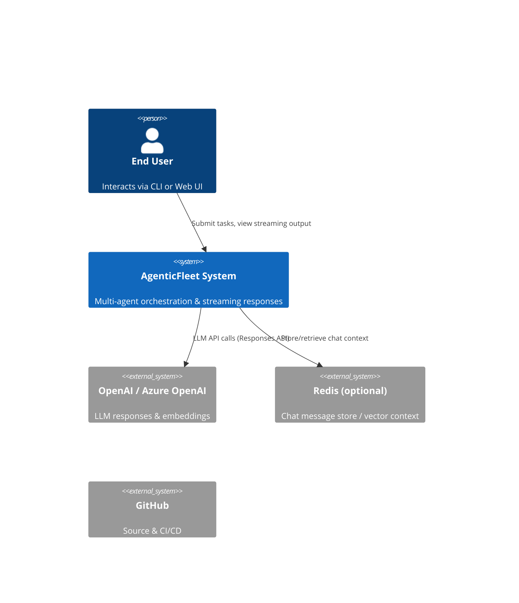
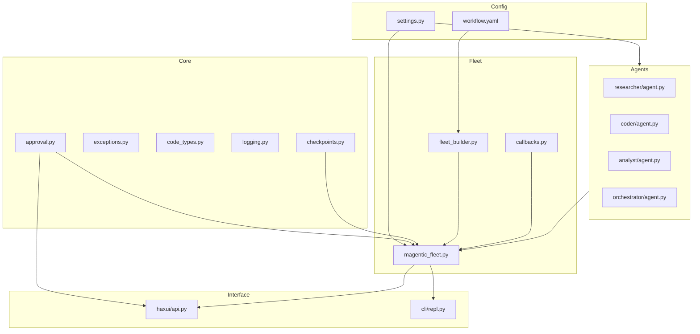
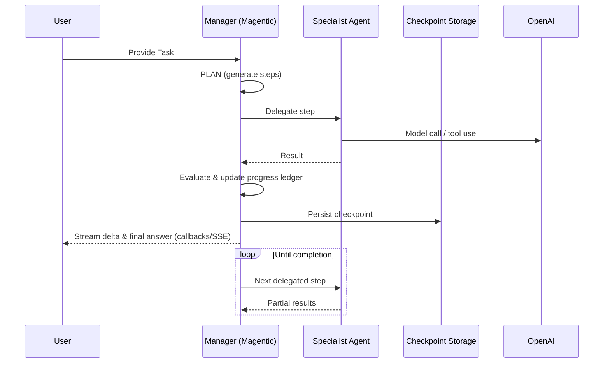

# Project Architecture Blueprint

Generated: 2025-10-23

## 1. Architecture Detection and Analysis

Technology stacks:

- Backend: Python 3.12+, Microsoft Agent Framework (Magentic pattern), FastAPI, Pydantic, OpenAI Responses API client, Redis (optional), SQLite (conversation store), dotenv, YAML config
- Frontend: React 18, Vite, TypeScript, Tailwind CSS, shadcn/ui, SSE streaming
- Tooling: uv (Python dependency management), make, Ruff, Black, mypy, Playwright (e2e)

Architectural style: Hybrid Modular Monolith with Event-Driven Orchestration and Plugin-based Agent Factories.

- Modular Monolith: Clear package segmentation (`agents`, `fleet`, `core`, `config`, `context`, `haxui`, `cli`, `workflows`, `frontend`). Runtime deployed as single backend service + static frontend.
- Event-Driven: Callback system in `fleet/callbacks.py` wires streaming/events from Magentic workflow (agent delta, progress ledger, final result) to UI (CLI + SSE).
- Plugin-based: Agents and tools are dynamically created via factories (`agents/<role>/agent.py`) reading declarative YAML. Tools adhere to Pydantic return schemas enabling interchangeability.
- Human-in-the-loop integration crosses layers via approval handler abstraction (`core/approval.py`, CLI and Web handlers) enabling controlled side-effect operations.

Detection indicators:

- Folder naming and boundaries align with domain responsibilities (agents vs orchestration vs UI vs config).
- Dependency flow: `fleet` depends on `agents`, `core`, `config`; `agents` depend on `core` + `config`; `core` does not depend on higher layers.
- Abstractions: Agent factories, ApprovalHandler, CheckpointStorage, Context providers. No circular imports observed.

## 2. Architectural Overview

Purpose: Coordinate multiple specialized AI agents (researcher, coder, analyst) using planning-evaluate-act cycles (Magentic workflow) with observability, safety (HITL), and persistence (checkpointing + memory).
Guiding principles:

- Configuration-first (YAML + env) over hardcoding
- Stable contracts via Pydantic models for tool outputs
- Extensibility through factories and builder pattern
- Observability and reproducibility (callbacks + checkpoints)
- Safety via explicit approval gating
  Boundaries:
- Core layer provides primitives (exceptions, approval, code types, logging)
- Agents encapsulate role-specific instructions + tools without orchestrator logic
- Fleet layer handles orchestration, building workflow, managing streaming callbacks
- HaxUI API provides HTTP/streaming facade (SSE) without embedding orchestration logic beyond runtime bridging
  Hybrid pattern notes:
- Workflow orchestrator (MagenticFleet) operates similarly to an application service coordinating plugins (agents). Event-driven streaming callbacks augment layered approach.

## 3. Architecture Visualization (C4 Diagrams)

### System Context (Level 1)



### Containers (Level 2)

```mermaid
C4Container
    System(agentic, "AgenticFleet") {
        Container(api, "FastAPI Backend", "Python/FastAPI", "Exposes REST & SSE endpoints")
        Container(cli, "CLI REPL", "Python", "Interactive terminal workflow")
        Container(orchestrator, "MagenticFleet Orchestrator", "Python", "Plan/delegate/aggregate agents")
        Container(agents, "Specialist Agents", "Python", "Researcher / Coder / Analyst")
        Container(frontend, "React Frontend", "TypeScript/React", "Renders streaming output & approvals")
        Container(store, "Checkpoint Storage", "Filesystem/SQLite", "Persist workflow state & conversations")
        Container(mem, "Context Providers", "Redis/Mem0", "Optional semantic memory")
    }
    System_Ext(openai, "OpenAI Responses API")
    Rel(cli, orchestrator, "User tasks & results (in-process)")
    Rel(frontend, api, "HTTP + SSE")
    Rel(api, orchestrator, "Invoke workflow runs")
    Rel(orchestrator, agents, "Delegation calls")
    Rel(orchestrator, store, "Checkpoint read/write")
    Rel(orchestrator, openai, "Model invocations")
    Rel(agents, openai, "Model invocations")
    Rel(orchestrator, mem, "Retrieve context (optional)")
```

### Backend Component Diagram (Level 3)



### Workflow Cycle Data Flow



## 4. Core Architectural Components

(Condensed summary; see later sections for extensibility.)

- Agents: Factory-created ChatAgents with role-specific instructions and tool lists; isolation ensures prompt specialization.
- FleetBuilder: Orchestration assembler applying config (round limits, plan review, callbacks).
- MagenticFleet: High-level orchestrator container adding coder tool, managing streaming run & approvals.
- Approval System: Abstract handler bridging CLI (`CLIApprovalHandler`) and web (`WebApprovalHandler`), normalizing decision flow.
- Checkpointing: File-based storage with normalized metadata enabling listing/resume.
- Context Providers: Optional Redis provider factory enabling semantic retrieval (future Mem0 integration).
- HaxUI FastAPI: Public API surface exposing entity catalog, conversation management, approvals, reflection workflow, SSE responses.
- CLI REPL: Terminal entrypoint wrapping workflow run loop and checkpoint management.

## 5. Architectural Layers and Dependencies

Layers:

1. Core (pure domain/util) – no upward dependencies.
2. Config (settings, YAML) – depends only on core.
3. Agents – depend on core + config; no direct knowledge of orchestrator implementation.
4. Fleet (builder + orchestrator) – depends on agents, core, config.
5. Interface (CLI + API) – depends on fleet + core + config.
6. Frontend – depends on API contracts (SSE event shapes) only.
   Dependency Rules:

- No component in lower layers imports interface or frontend code.
- Tools return Pydantic models to stabilize cross-layer contract.
- YAML is single source for dynamic attributes (models, prompts, tool enablement) ensuring runtime override without code change.

## 6. Data Architecture

Primary data structures:

- Agent Instructions & Config (YAML): Static declarative definitions.
- ApprovalRequest/ApprovalResponse (Pydantic) guarantee structured HITL decisions.
- CodeExecutionResult & other tool schemas represent typed outputs.
- Checkpoints: JSON snapshots of workflow state (round index, progress ledger) enabling resume.
- Conversations: SQLite-backed storage of message history (HaxUI) for SSE sessions.
- Memory: Optional semantic context provider retrieving embeddings (Redis). Mem0 integration path documented but not active.
  Data Access Patterns:
- File I/O for checkpoints (append-only snapshots)
- SQLite CRUD for conversations (normalized by conversation_id)
- Redis ephemeral retrieval for augmentation (optional)
  Transformation:
- Normalization of checkpoint metadata for consistent listing.
- SSE event encoding uses JSON serialization with consistent type tags.
  Caching:
- Redis provider acts as context cache; conversation store persists historical context.
  Validation:
- Pydantic models enforce schema at boundaries (approvals, tool outputs, API responses).

## 7. Cross-Cutting Concerns

- Authentication: API key requirement for OpenAI usage (validated via `Settings.require_openai_api_key`). No custom auth layer for HaxUI yet (open CORS allowed).
- Authorization: Operation gating via approval handler lists (require_approval_for vs trusted_operations).
- Error Handling: Custom exception hierarchy (WorkflowError, ToolExecutionError, etc.) for semantic catching/logging.
- Resilience: Plan review + stall/reset counters to avoid infinite loops; checkpoint resume for recovery; streaming fallback path if async generator unavailable.
- Logging: Centralized setup (`core/logging.setup_logging`), log level via env var, structured messages for workflow events.
- Observability: Optional OpenTelemetry tracing initialization (`observability.setup_tracing` / agent_framework integration).
- Configuration Management: `.env` + YAML; path rewriting ensures runtime directories under `var/`.
- Validation: Tests (`tests/test_config.py`) verify config integrity and agent factories.

## 8. Service Communication Patterns

- Internal orchestration: In-process method invocation between manager and agents.
- External model calls: Synchronous API calls via `OpenAIResponsesClient`.
- Streaming: Asynchronous generator `run_stream` emits Magentic events; SSE responses chunk assistant output (`response.output_text.delta`).
- HITL: Approval requests polled & emitted as SSE events; responses posted via REST route; decisions fed back into orchestration or tool execution.
- Reflection workflow: Secondary workflow-as-agent pattern streaming interleaved reviewer events.
  Protocol Formats:
- SSE JSON events with `type` discriminators.
- REST JSON bodies for conversation and approval endpoints.

## 9. Technology-Specific Patterns

Python:

- Factory functions for agents promote dependency injection & config-driven design.
- Pydantic ensures strict data contracts (extra=forbid) preventing drift.
- Async streaming via async generators and event type pattern matching.
- Use of `uv` for reproducible environment & tasks (never raw pip).
  React:
- SSE consumption pattern (frontend not shown here) expects stable event taxonomy (`response.output_text.delta`, `response.completed`, `workflow.event`, `function_approval.request`).
- Likely hooks-based state management + incremental rendering of deltas.
  FastAPI:
- Dependency injection for runtime and handler singletons via `Depends`.
- StreamingResponse for long-lived SSE connections; heartbeat comments maintain liveness.

## 10. Implementation Patterns

Interface Design:

- Abstract `ApprovalHandler` defines async approval semantics; CLI/Web handlers implement UI logic.
- Builder pattern (`FleetBuilder`) encapsulates optional features enabling clear chaining.
  Service Lifecycle:
- `MagenticFleet` constructs workflow early; first run may attach coder tooling; state includes workflow_id for checkpoint correlation.
  Repository-like Patterns:
- ConversationStore and CheckpointStorage standardize persistence operations.
  Controller/API Patterns:
- FastAPI routes map to CRUD for conversations and streaming for responses.
  Domain Events:
- MagenticCallbackEvents classify orchestration phases; unified callback dispatch simplifies extension.
  Error Handling Implementation:
- Fallback paths for streaming vs non-streaming; silent guards (pragma no cover) for defensive coding when dependencies missing.

## 11. Testing Architecture

Test Layers:

- Configuration tests validate YAML correctness & agent creation invariants.
- Workflow tests ensure orchestrator builds and runs (magentic_fleet, dynamic workflow).
- HITL tests exercise approval flow (manual & automatic).
- SSE integration tests confirm event sequencing & streaming correctness.
- E2E Playwright tests validate browser rendering & workflow execution path.
  Test Doubles:
- Mocking `OpenAIResponsesClient` to avoid real API calls in unit tests.
  Boundaries:
- Avoid adding prompts or business logic to tests; assertions on structure & event presence.

## 12. Deployment Architecture

Topology:

- Single Python service (FastAPI) + optional CLI tool + static React build.
- File-based checkpoints persist across restarts enabling resumed workflows.
  Runtime Config:
- Environment flags enable tracing & memory providers; `.env` isolates secrets.
  Packaging:
- `pyproject.toml` (hatchling) for backend, `npm build` for frontend.
  Scaling Considerations:
- SSE concurrency limited by `haxui.concurrency.max_parallel_requests`.
- Future decomposition to microservices possible at agent boundary or conversation persistence abstraction.

## 13. Extension and Evolution Patterns

Feature Addition:

- Add agent: scaffold directory, config.yaml, factory; register in `agents/__init__.py` and update manager instructions; extend tests.
- Add tool: implement function returning Pydantic model, add to agent config tools list, document in system prompt.
- Add callback: extend unified callback routing or create new specialized consumer in `callbacks.py`.
  Variation Points:
- YAML prompts & limits; model selection per agent; plan review toggle.
  Plugin Mechanism:
- Tools list acts as plugin registry; dynamic enablement via config.
  Backward Compatibility:
- Maintain event names; ensure tool schemas remain stable; provide upgrade path for memory integration.
  Migration Strategy:
- Introduce new agents behind config flags; dual-run new vs old in tests before switching.

## 14. Architectural Pattern Examples

(Representative excerpts with file references.)

1. Agent Factory (Researcher): `agents/researcher/agent.py` loads config, builds Responses client, filters tools list.
2. Builder Chain: `fleet/fleet_builder.py` method chaining `.with_agents().with_manager().with_observability().with_checkpointing().with_plan_review()` constructs workflow.
3. Approval Flow: `core/approval.py` defines `ApprovalRequest/ApprovalResponse`; `haxui/api.py` route `/v1/approvals/{id}` sets decision.
4. Streaming Event Handling: `fleet/fleet_builder.py` unified callback inspects event type and dispatches to console callbacks.
5. Checkpoint Listing: `magentic_fleet.py` `list_checkpoints` normalizes metadata for UI display.
6. Path Rewriting: `config/settings.py` `_rewrite_runtime_path` ensures legacy paths map under `var/`.

## 15. Architectural Decision Records

1. YAML-First Configuration

- Context: Need non-code prompt & model tuning.
- Decision: All agent prompts & enablement defined in config.yaml.
- Alternatives: Hardcoded strings; database-backed config.
- Consequences: Easy tuning; must validate YAML integrity (tests). Future: Add schema validation.

2. Modular Monolith over Microservices

- Context: Early-stage system requiring low coordination overhead.
- Decision: Single deployable with clear internal boundaries.
- Alternatives: Separate services per agent.
- Consequences: Simplifies deployment; potential scaling bottleneck if agents become resource-heavy.

3. Magentic Pattern Adoption

- Context: Need structured planning loop with dynamic delegation.
- Decision: Use Microsoft Agent Framework Magentic workflow.
- Alternatives: Custom multi-agent controller.
- Consequences: Leverages tested orchestration semantics; dependency on framework updates.

4. Pydantic Schemas for Tool Outputs

- Context: Agents must parse structured tool results reliably.
- Decision: Tools return strongly typed models.
- Alternatives: Raw dicts or string outputs.
- Consequences: Early validation; schema evolution requires careful versioning.

5. HITL Approval Abstraction

- Context: Sensitive operations need oversight.
- Decision: `ApprovalHandler` interface with CLI/Web implementations.
- Alternatives: Inline conditional prompts.
- Consequences: Extensible for future policy engines; adds latency for approved operations.

6. SSE Streaming for Frontend

- Context: Need incremental UI updates.
- Decision: SSE with typed events.
- Alternatives: WebSockets, long polling.
- Consequences: Simpler infra; single-direction stream; future binary/events may need WebSockets.

7. uv Package Manager Usage

- Context: Fast, reproducible Python dependency management.
- Decision: Mandate `uv run` for all commands.
- Alternatives: pip + venv.
- Consequences: Faster installs; contributor learning curve.

## 16. Architecture Governance

Mechanisms:

- Tests enforcing configuration & agent integrity (`tests/test_config.py`).
- Make targets (`make check`, `make validate-agents`) for lint, type, doc invariants.
- Invariants documented in `AGENTS.md` (no hardcoded model names, YAML-first).
- Review process: PR guidelines require running config validation + quality checks.
  Automation Opportunities:
- Future: YAML schema validation; architectural dependency graph lint (prevent upward imports).

## 17. Blueprint for New Development

Workflow:

1. Define change in YAML (model, prompt, tool enablement).
2. Implement factory/tool code referencing config (never hardcode).
3. Extend tests (config + functional).
4. Run `make test-config`, `make check`.
5. Update `AGENTS.md` + Architecture Blueprint if introducing new pattern.
   Templates:

- Agent Factory: Copy existing `create_<role>_agent` pattern.
- Tool: Function returning Pydantic model with docstring, import in agent factory when enabled.
  Dependency Declaration:
- Add imports only to appropriate layer; avoid core referencing interface.
  Common Pitfalls:
- Hardcoding models violating invariants.
- Forgetting to update tests after YAML change.
- Adding new SSE event types without frontend sync.
  Performance Considerations:
- Limit tool calls; enable checkpointing for lengthy tasks; consider rate limit backoff logic.
  Testing Blind Spots:
- Memory provider integration; path rewriting edge cases; approval timeouts.
  Updating This Blueprint:
- Regenerate after structural changes (new layers, agents, or event types) and increment version header.

---

Maintain this document as living architecture knowledge. Align code changes with stated patterns; deviations should be justified with new ADR entries.
