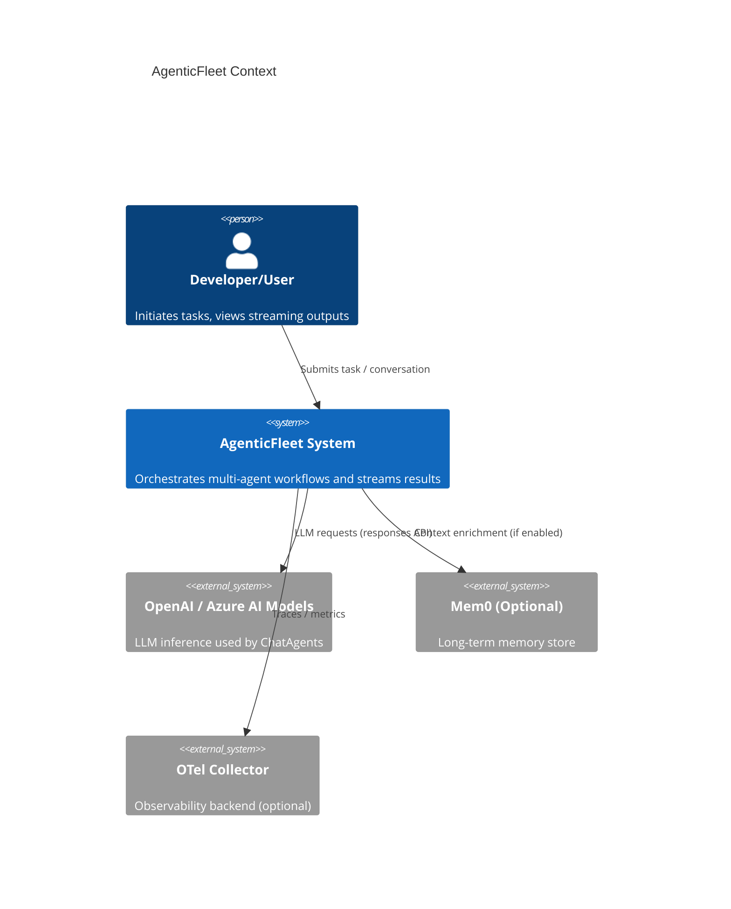
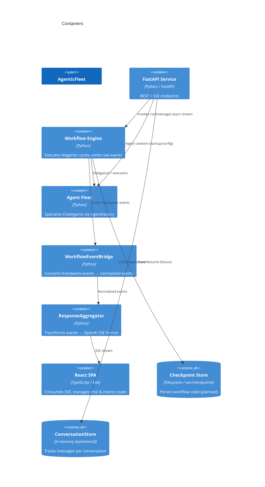
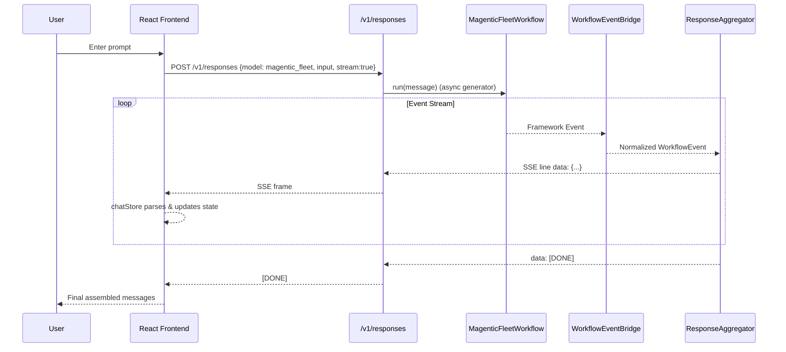

# Project Architecture Blueprint

Generated: 2025-11-05
Repository: `agentic-fleet`
Version Context: README indicates production-ready v0.5.5

---

## 1. Architecture Detection and Analysis

### Technology Stacks (Auto‑detected)

- Backend: Python 3.12+, FastAPI, Microsoft Agent Framework (`agent_framework`), Pydantic, Typer CLI, uv (package manager), optional OpenTelemetry.
- Frontend: React (Vite 7.x), TypeScript, Zustand (state), shadcn/ui + Tailwind CSS 4.x, SSE consumption via Fetch streaming.
- Workflow / Orchestration: Magentic pattern (dynamic orchestration and reflection), custom `WorkflowEventBridge` mapping agent framework events → API/SSE.
- Tooling & Utilities: `ToolRegistry`, `AgentFactory`, YAML-driven `WorkflowFactory`, logging utilities, correlation IDs middleware.

### Architectural Pattern(s)

Hybrid combination of:

- Event-Driven Architecture (workflow emits granular events converted for streaming).
- Layered / Modular Monolith (clear separation: API layer, workflow layer, agents, prompts, integrations, frontend client).
- Plugin / Configuration-Driven Pattern (agents defined declaratively via YAML + `get_config()` helpers, prompts resolved dynamically).
- Builder Pattern (MagenticFleetWorkflowBuilder / MagenticFleetBuilder stubs wrap underlying framework).
- Clean Architecture influences (inversion around agent creation; environment/config isolation).
- Workflow Pattern (PLAN → EVALUATE → ACT → OBSERVE cycle) aligned with Magentic One.

### Structural Indicators

- Central workflows defined under `src/agentic_fleet/workflow/`.
- Agents registry modules each export `get_config()` (prompts resolved via dynamic import) → encourages declarative persona definitions.
- SSE conversion isolating side-effect concerns in `api/responses/service.py` (ResponseAggregator) and event translation in `workflow/events.py` (WorkflowEventBridge).
- Environment & config resolution boundaries: `WorkflowFactory` chooses YAML via layered resolution order (env override → repo config → packaged default).

### Component Boundaries & Communication

- External dependencies abstracted: `OpenAIResponsesClient` hidden behind agent configs/tools.
- Workflow to API boundary: asynchronous generator streaming events → aggregator transforms to OpenAI-compatible SSE.
- Frontend consumes normalized event types (`response.delta`, `orchestrator.message`, `agent.message.complete`, `response.completed`).

---

## 2. Architectural Overview

AgenticFleet orchestrates a configurable fleet of specialist AI agents using the Magentic workflow pattern. The system centers on a manager (orchestrator) that plans, evaluates, delegates, and aggregates results. Specialized agents (planner, executor, coder, verifier, generator) perform domain tasks.

Guiding Principles:

- Declarative over imperative: Do not hardcode prompts/models—encode in YAML or dedicated prompt modules.
- Stream-first UX: granular agent deltas surfaced as SSE for responsive UI updates.
- Extensibility: add agents/tools without modifying core streaming or API schema.
- Resilience & clarity: robust error events, correlation IDs, strict logging sanitization.
- Separation of concerns: translation (event bridge) distinct from transport (aggregator) distinct from workflow logic.

Architectural Boundaries:

- Workflow core never imports frontend code.
- API routes expose uniform JSON/SSE; agents and tools resolved through factory and registry layers.
- Environment-dependent concerns gated behind optional imports (e.g., OpenTelemetry, Mem0 integration placeholder).

Hybrid Adaptations:

- Clean + Event‑Driven: Domain events are adapted into OpenAI event taxonomy for compatibility.
- Builder stub pattern: `MagenticFleetBuilder` future-proofs advanced orchestration (checkpointing, approval gates) though orchestrator is not fully implemented yet (`NotImplementedError` acts as guardrail).

---

## 3. Architecture Visualization

### 3.1 C4 Context Diagram



### 3.2 C4 Container Diagram



### 3.3 Component Interaction Diagram

```mermaid
flowchart LR
User -->|HTTP POST /v1/responses| API[FastAPI Responses Route]
API --> WF[MagenticFleetWorkflow.run(message)]
WF -->|async events| Bridge[WorkflowEventBridge.convert_event]
Bridge --> Agg[ResponseAggregator.convert_stream]
Agg -->|SSE frames\n(response.delta etc.)| Browser[React Chat Store]
Browser --> UI[Components / State]
```

### 3.4 Sequence: Streaming Lifecycle



### 3.5 Data Flow (Textual)

1. User input → `/v1/responses` → workflow event stream.
2. Each framework event → `WorkflowEventBridge` normalization (e.g., delta vs orchestrator message).
3. Normalized events → `ResponseAggregator` accumulates & outputs SSE frames.
4. Frontend store applies per-agent accumulation, orchestrator ledger updates, metrics increments.

---

## 4. Core Architectural Components

| Component               | Purpose                                                 | Internal Structure                                           | Interaction                                      | Evolution Points                                                       |
| ----------------------- | ------------------------------------------------------- | ------------------------------------------------------------ | ------------------------------------------------ | ---------------------------------------------------------------------- |
| `WorkflowFactory`       | Resolve & load workflow YAML                            | Env override + repo + package fallback                       | Supplies `WorkflowConfig` to builders            | Add fields to YAML without touching code; maintain strict mapping type |
| `MagenticFleetWorkflow` | Wrap underlying MagenticBuilder instance, stream events | Maintains last agent/kind for synthetic progress events      | Provides async generator to API layer            | Extend with richer progress heuristics / instrumentation               |
| `WorkflowEventBridge`   | Normalize raw framework events → stable API schema      | Type checks multiple event classes; JSON-safe conversion     | Called per event; stateless                      | Add new event types without breaking consumers (open-extension)        |
| `ResponseAggregator`    | Transform normalized events → OpenAI Responses SSE      | Accumulates content state; emits `[DONE]` fallback if needed | Consumed in `/v1/responses` route                | Extend for tool-specific events (code execution outputs, images)       |
| `AgentFactory`          | Instantiate ChatAgents with dynamic prompts & tools     | Resolves instructions module references; builds client       | Used during workflow setup                       | Add caching, fallback models, multi-provider support                   |
| `ConversationStore`     | Lightweight in-memory message tracking                  | Dict keyed by conversation id; append semantics              | Used via `/v1/chat` & `/v1/conversations` routes | Replace with persistent DB, add indexing, retention policies           |
| Frontend `chatStore.ts` | Manages streaming assembly and orchestrator ledger      | Zustand store with explicit callbacks                        | Consumes SSE; updates UI components              | Introduce virtualization, per-agent diff views, multi-tab state        |
| `metricsStore.ts`       | Placeholder for telemetry aggregation                   | Counters & per-agent metrics                                 | Updated during streaming / events                | Integrate real-time charts, persistence, thresholds                    |

---

## 5. Architectural Layers and Dependencies

Layers:

1. Interface Layer: FastAPI routes (`api/.../routes.py`), Typer CLI (`console.py`), static file serving.
2. Application / Orchestration Layer: Workflow implementation (`magentic_workflow.py`), event bridge, response aggregation.
3. Domain Layer: Agent definitions (`agents/*.py`), prompt content (`prompts/*.py`), workflow config resolution, tool registry.
4. Infrastructure Layer: External service clients (`OpenAIResponsesClient`), logging, correlation middleware, (future) checkpoint persistence.
5. Presentation Layer: React SPA (stores, components, hooks) — separate dependency graph.

Dependency Rules:

- Routes depend on orchestration and domain, not vice-versa.
- Domain (agents/prompts) is configuration-driven; no coupling to transport.
- EventBridge & Aggregator are pure transformation components (stateless or easily resettable) — can be unit tested independently.

Abstraction Mechanisms:

- Factories (`AgentFactory`, `WorkflowFactory`) hide creation complexity.
- Builder pattern encapsulates multi-step configuration.
- Prompt resolution by string module reference decouples code from text assets.

No circular dependencies detected among core modules (factories invoked only where needed). `MagenticFleetBuilder` currently raises `NotImplementedError` intentionally to enforce orchestrator completion before dependency graph expansion.

---

## 6. Data Architecture

Domain Data:

- Conversation: ephemeral message list with role, content, timestamp.
- Workflow Events: transient streaming payloads; not persisted except optionally via future checkpointing.
- Agent Config: YAML + dynamic `get_config()` dictionaries.
- Memory (Mem0) placeholder for persistence of long-term context (feature gated by env vars / extras).

Entity Relationships:

- Workflow ↔ Agents (composition): manager delegates to specialized agents.
- Conversation ↔ Messages (aggregation).
- Agent ↔ Tools (association via registry resolution).

Data Access Patterns:

- In-memory stores (conversation, metrics) for low-latency ephemeral interaction.
- YAML configuration parsed once at factory init → cached in instance.
- Future checkpointing (builder method already surfaces enabling flag) will allow periodic serialization of workflow state to `var/checkpoints`.

Transformation & Mapping:

- EventBridge converts arbitrary agent_framework event objects into JSON-safe dictionaries.
- ResponseAggregator maps internal events to OpenAI SSE taxonomy while aggregating deltas.

Caching Strategies:

- Implicit: YAML loaded once per `WorkflowFactory`. No explicit external cache yet.

Validation Patterns:

- Defensive type checks in factories and builder (`ValueError` raised on missing model or workflow id mismatch).
- Tests assert structural integrity (`test_workflow_factory.py`).

---

## 7. Cross-Cutting Concerns Implementation

Authentication & Authorization:

- Not implemented (system assumes trusted local usage). Future extension: add API key or JWT middleware.

Error Handling & Resilience:

- Response streaming: any exception yields structured SSE error event + `[DONE]` sentinel to maintain protocol integrity.
- Unknown events gracefully downgraded to `type: unknown` preserving raw string for debugging.
- Builder stubs enforce explicit failure (`NotImplementedError`) for incomplete orchestrator implementation rather than silent misconfiguration.

Logging & Monitoring:

- Central `setup_logging()` configures uniform format; correlation IDs injected via `CorrelationMiddleware` for request tracing.
- Optional OpenTelemetry via `setup_observability` (import guarded).
- Logging sanitization strips control characters to mitigate log injection.

Validation:

- YAML top-level mapping enforced; configuration presence validated; missing env vars (e.g., `OPENAI_API_KEY`, `OPENAI_BASE_URL`) produce early `ValueError`.

Configuration Management:

- Multi-tier resolution (env → repo → package). Environment variables gate model access, observability, memory integration.
- Secrets contained only in runtime environment (`.env` usage via `dotenv`).

Feature Flags / Options:

- Checkpointing, approval gates, dynamic orchestration toggled via builder methods (extensible for future runtime toggles).

---

## 8. Service Communication Patterns

Boundaries:

- Public HTTP API: `/v1/*` (system, workflows, conversations, responses, approvals, entities).
- Streaming: SSE over `/v1/responses` and `/v1/chat` (chat route uses Accept: text/event-stream).

Protocols / Formats:

- JSON over REST; SSE framing for streaming; OpenAI-compatible event schema for downstream tool compatibility.

Sync vs Async:

- Backend streaming uses async generators; frontend handles back-pressure by incremental decoding of ReadableStream.

Versioning Strategy:

- Base prefix `/v1` reserved; backward compatibility maintained by including legacy router mounting (e.g., health endpoints at `/v1/system` and `/v1/health`). Future: Introduce `/v2` while preserving conversion layer.

Service Discovery:

- Internal service discovery abstracted—`get_entity_discovery()` supplies workflow instances; currently local static resolution.

Resilience Patterns:

- Graceful fallback events, error sentinel, correlation IDs, structured error shapes.

---

## 9. Technology-Specific Architectural Patterns

### Python

- Async streaming via `async for` generators (`MagenticFleetWorkflow.run`).
- Builder + Factory separation for orchestration config vs instantiation.
- Dynamic import of prompt modules for instruction resolution (`prompts.<name>`).
- Strict typing (PEP 604 union syntax) and Pydantic model usage for SSE events.

### React

- Centralized state using Zustand (lightweight store) with fine-grained callbacks for SSE events.
- Accumulation pattern distinguishes agent message boundaries vs orchestrator ledger messages.
- Environment-based configuration via `import.meta.env.*` variables.

### Event-Driven Patterns

- Normalization layer decouples raw events from consumer semantics.
- SSE aggregator ensures universal `[DONE]` event even for truncated streams.

---

## 10. Implementation Patterns

Interface Design:

- Protocol-like usage (`RunsWorkflow`) indicates expected `.run()` method returning async generator.
- Conversion functions isolate polymorphic event handling (duck typing + introspection).

Service Implementation:

- Routes as thin coordinators delegating to factories / workflow instances (SRP).
- Aggregator acts like a streaming decorator transforming event semantics.

Repository Pattern (Lightweight):

- `ConversationStore` functions as in-memory repository with CRUD semantics.

Controller/API Patterns:

- Uniform SSE emission lines begin with `data:` ensuring compliance (verified by tests).
- Non-streaming path reuses aggregator to minimize divergence (DRY principle).

Domain Model Patterns:

- Agents configured via dictionaries from `get_config()` → layered with reasoning metadata and tool lists.
- Prompts return raw instruction strings to avoid coupling to agent creation code.

Concurrency & Streaming:

- Single pass zero-copy event yield in `MagenticFleetWorkflow.run` (immediate conversion / yield).

Error Pattern:

- Always emit final structured event followed by `[DONE]` (idempotent completion signaling).

---

## 11. Testing Architecture

Test Boundary Types:

- Configuration tests (`test_workflow_factory.py`) validate resolution logic + env overrides.
- Event bridge tests ensure unknown events degrade safely (`test_event_bridge.py`).
- SSE format tests assert framing and schema integrity (`test_api_responses_streaming.py`).
- Store tests verify repository semantics (`test_memory_system.py`).

Mocking & Isolation:

- External network calls (LLM) implicitly mocked via test design (not shown here; recommended to patch `OpenAIResponsesClient`).
- SSE consumption tested with `httpx.AsyncClient` + `ASGITransport` for in-process integration.

Test Data Strategies:

- Simple static inputs (“Test”, “Test accumulation”) reduce complexity while focusing on stream structure.

Future Additions:

- Snapshot-based tests for prompt evolution.
- Performance / load tests for streaming latency (foundation exists under `tests/load_testing/`).

---

## 12. Deployment Architecture

Topology:

- Single FastAPI process optionally serving static React build (`ui/` directory) for SPA.
- Frontend dev served separately via Vite (hot reload) in development.

Runtime Config:

- Host/Port via `HOST`, `PORT`; reload toggled by `ENVIRONMENT`.
- Observability gated by `ENABLE_OTEL`, `OTLP_ENDPOINT`.
- Memory integration variables for Mem0; embeddings model selection via `OPENAI_EMBEDDING_MODEL`.

Packaging:

- Python: uv-managed lock file; Hatchling (per README) for builds.
- Frontend: Vite 7.x bundling; environment variables injected at build time.

Containerization (Recommended):

- Multi-stage Docker: build frontend → copy static assets → serve via FastAPI + Uvicorn / Gunicorn.
- Add health endpoints (`/v1/health`) for readiness/liveness.

---

## 13. Extension and Evolution Patterns

Feature Addition:

1. Add new agent: create `agents/<role>.py` with `get_config()`, add prompt module.
2. Update `workflows.yaml` with new agent entry; run `make test-config`.
3. Optionally add specialized tools in `core/registry.py` and tests.
4. Re-run validation & streaming tests to ensure event coverage.

Modification:

- Alter event schema only within `WorkflowEventBridge` (central choke point) and update corresponding frontend parser logic.
- Adjust streaming semantics by extending `ResponseAggregator.convert_stream`; tests provide contract safety.

Deprecation:

- Mark legacy event types internally and maintain mapping until a major version bump; add adapter for backward compatibility.

Integration:

- External system: implement new tool class, register in `ToolRegistry`, reference in agent config; avoid direct API calls from agent definitions.
- Anti-corruption layer: create adapter module that transforms external response into domain events consumed by Bridge.

---

## 14. Architectural Pattern Examples

### Example: Event Normalization

```python
# workflow/events.py (excerpt)
if isinstance(event, MagenticAgentDeltaEvent):
    return {"type": "message.delta", "data": {"delta": event.text or "", "agent_id": event.agent_id}}
```

### Example: SSE Aggregation

```python
async for event in events:
    if event_type == "message.delta":
        delta_event = ResponseDeltaEvent(...)
        yield f"data: {delta_event.model_dump_json()}\n\n"
```

### Example: Declarative Agent Config

```python
# agents/coder.py
return {
  "model": "gpt-5-mini",
  "instructions": "prompts.coder",
  "tools": ["HostedCodeInterpreterTool"],
  ...
}
```

### Example: Prompt Resolution

```python
# coordinator.AgentFactory._resolve_instructions
prompt_module = importlib.import_module(f"agentic_fleet.prompts.{module_name}")
return str(prompt_module.get_instructions())
```

### Example: Workflow Streaming Wrapper

```python
async for event in self._workflow.run_stream(message):
    converted = self._event_bridge.convert_event(event, openai_format=True)
    yield converted
```

### Example: Frontend SSE Consumption

```typescript
if (rawEvent.type === "response.delta") {
  callbacks.onDelta?.(rawEvent.delta, agentId);
}
```

---

## 15. Architectural Decision Records (ADRs)

### ADR-001: YAML-Driven Workflow & Agent Configuration

Context: Need flexible non-code tuning.
Decision: Centralize in `workflows.yaml` + `get_config()` modules.
Consequences: Faster iteration, testable via `test_config`; requires vigilance against drift.

### ADR-002: SSE + OpenAI-Compatible Event Schema

Context: Provide real-time updates & integrate with tooling expecting OpenAI events.
Decision: Normalize events then aggregate to SSE frames using OpenAI taxonomy.
Consequences: Simplifies frontend; adds translation overhead; ensures `[DONE]` sentinel uniformity.

### ADR-003: Stateless Event Bridge

Context: Maintain minimal coupling & testability.
Decision: Pure conversion function `WorkflowEventBridge.convert_event` without internal state.
Consequences: Easy to extend; must carry prior context (agent transitions) outside bridge (handled in workflow wrapper).

### ADR-004: Zustand Over Redux/MobX

Context: Need lean, minimal-boilerplate streaming store.
Decision: Use Zustand for simple immutable updates.
Consequences: Faster development; small surface; potential need for middleware if complexity grows.

### ADR-005: uv for Python Dependency Management

Context: Performance & reproducibility.
Decision: Adopt `uv` over pip/Poetry.
Consequences: Faster sync; requires contributor familiarity; lock file discipline.

### ADR-006: Builder Stub with Explicit NotImplementedError

Context: Future advanced orchestration requirements (checkpointing, approval gates).
Decision: Provide stub `MagenticFleetBuilder.build()` raising until orchestrator implemented.
Consequences: Prevents partial feature exposure; ensures architectural integrity check.

---

## 16. Architecture Governance

Mechanisms:

- Documentation invariants enforced via `make validate-agents` (keeps AGENTS docs synchronized).
- Tests assert critical protocol contracts (SSE formatting, config resolution).
- Coding conventions enforced by `make check` (ruff, black, mypy).
- Explicit environment variable requirements fail fast (AgentFactory checks API keys).
- Single source of truth for prompts & workflows ensures traceability.

Compliance Automation (Recommended Enhancements):

- Add lint rule or script to detect hard-coded model IDs in Python/TS.
- Integrate dependency graph validation to prevent accidental circular imports.

Documentation Practices:

- Multi-level AGENTS files (root + subdirectories) encode architectural roles.
- Release notes capture event taxonomy changes & performance metrics.

---

## 17. Blueprint for New Development

### Development Workflow

1. Define new agent config & prompt.
2. Update workflow YAML; run `make test-config`.
3. Implement new tool (if needed) + register.
4. Add tests: event conversion, config integrity, streaming delta accumulation.
5. Run `make check` and `uv run pytest -k <new feature>`.

### Implementation Templates

- Agent: `agents/<role>.py` with `get_config()` including reasoning metadata.
- Prompt: `prompts/<role>.py` exposing `get_instructions()`.
- Tool: registry entry (extend `tools/registry.py` via `ToolRegistry`) + Pydantic output model colocated with the tool module (define or reuse existing response schemas). (Removed stale reference to `core/code_types.py` which is not present in current tree.)
- Event: Extend `WorkflowEventBridge.convert_event` with new branch; add test ensuring conversion.

### Common Pitfalls & Avoidance

| Pitfall                                         | Avoidance                                                       |
| ----------------------------------------------- | --------------------------------------------------------------- |
| Hardcoding prompt in agent factory              | Use module reference `prompts.<name>`                           |
| Missing `[DONE]` sentinel on errors             | Always catch exceptions in aggregator and emit error + `[DONE]` |
| Drift between backend events & frontend parsing | Update chatStore & API tests together (dual change)             |
| Skipped YAML validation                         | Run `make test-config` after edit                               |
| Logging injection risk                          | Use `sanitize_for_log()` before logging external strings        |

### Performance Considerations

- Maintain zero-copy streaming (avoid buffering entire result before sending).
- Batch metrics updates (optional future optimization if high event volume).
- Introduce checkpoint persistence only when tasks are long-running to reduce overhead.

### Testing Blind Spots (Recommendations)

- Add test for orchestrator progress events once dynamic orchestration toggles are implemented.
- Add simulation tests for multi-agent agent_id switching (frontend message split logic).
- Stress test under artificial high-frequency delta events.

### Keeping Blueprint Updated

- Regenerate after major version change or introduction of new event types.
- Tag ADRs with date & version impact; maintain log in `docs/architecture/adr/` (future suggestion).

---

## Appendix: Future Enhancements Roadmap (Non-Normative)

- Implement full `MagenticOrchestrator` bridging `MagenticFleetBuilder` stub to active workflow runtime.
- Persist conversation & checkpoints to pluggable storage (Cosmos DB recommended for global distribution per provided guidance file).
- Add vector memory integration leveraging Mem0 embeddings for context retrieval.
- Introduce structured progress ledger SSE event channel distinct from delta content.

---

**End of Blueprint**
