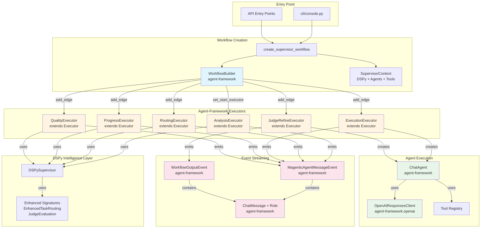

# Architecture Documentation

## Overview

AgenticFleet combines Microsoft's agent-framework with DSPy's intelligent prompt optimization to create self-improving multi-agent workflows.

## System Architecture

### Core Components

```
┌─────────────────────────────────────────────────────────────┐
│                    Entry Point                                │
├─────────────────────────────────────────────────────────────┤
│                    cli/console.py (CLI)                      │
└──────────────────────────┬───────────────────────────────────┘
                           │
              ┌────────────▼──────────┐
              │ SupervisorWorkflow    │
              │  (Orchestrator)       │
              └────────────┬──────────┘
                           │
        ┌──────────────────┼──────────────────┐
        │                  │                  │
┌───────▼──────┐ ┌─────────▼────┐ ┌──────────▼──────┐
│ DSPySupervisor│ │   Agents    │ │  ToolRegistry   │
│  (Routing)    │ │  (Execute)   │ │   (Metadata)    │
└───────┬──────┘ └──────────────┘ └─────────────────┘
        │
┌───────▼──────┐
│  Signatures  │
│  (Prompts)   │
└──────────────┘
```

### Data Flow

1. **Task Input** → Console receives user task
2. **DSPy Analysis** → Supervisor analyzes task complexity and requirements
3. **DSPy Routing** → Supervisor routes task to appropriate agents
4. **Agent Execution** → Agents execute in parallel/sequential/delegated mode
5. **Quality Assessment** → DSPy evaluates output quality
6. **Refinement** → Optional refinement if quality < threshold
7. **History Persistence** → Execution saved to history

### Agent-Framework Integration Architecture

The workflow is built entirely on agent-framework primitives:



**Key Agent-Framework Components:**

1. **WorkflowBuilder** (blue): Constructs the executor graph with `.set_start_executor()` and `.add_edge()`
2. **Executors** (orange): All 6 fleet executors extend `agent_framework.Executor` and use `@handler` decorator
3. **ChatAgent** (green): Created via `agent_framework.ChatAgent` with `OpenAIResponsesClient`
4. **Events** (pink): `MagenticAgentMessageEvent` and `WorkflowOutputEvent` with `ChatMessage` + `Role` enum

### OpenAI Response Format Usage

AgenticFleet uses the **OpenAI Response format** throughout, ensuring compatibility with agent-framework's event system:

**ChatMessage + Role Enum:**

```python
from agent_framework import ChatMessage, Role

# Used in event streaming
MagenticAgentMessageEvent(
    agent_id="fleet",
    message=ChatMessage(
        role=Role.ASSISTANT,  # Uses Role enum (SYSTEM, USER, ASSISTANT)
        text="Processing task...",
    ),
)
```

**OpenAIResponsesClient:**

```python
from agent_framework.openai import OpenAIResponsesClient

# Used for all ChatAgent instances
chat_client = OpenAIResponsesClient(
    model_id=model_id,
    api_key=api_key,
    reasoning_effort=reasoning_effort,
    reasoning_verbosity=reasoning_verbosity,
    temperature=temperature,
    max_tokens=max_tokens,
)

agent = ChatAgent(
    name=agent_name,
    chat_client=chat_client,  # OpenAIResponsesClient (not OpenAIChatClient)
    instructions=instructions,
    tools=tools_param,
)
```

**Why OpenAIResponsesClient:**

- ✅ Structured output support with better type safety
- ✅ Access to newer OpenAI Responses API features
- ✅ Better integration with Pydantic models for tool responses
- ✅ Official recommended pattern for agent applications
- ✅ Proper `ChatMessage` + `Role` enum support for event streaming

### Workflow Execution Flow


> Entry point: [`cli/console.py`](src/agentic_fleet/cli/console.py:39) provides the Typer CLI used to start workflows.

### Agent-Framework Integration Summary

**All workflow orchestration uses agent-framework primitives:**

| Component            | Agent-Framework Usage                                   | Location                             |
| -------------------- | ------------------------------------------------------- | ------------------------------------ |
| **Workflow Graph**   | `WorkflowBuilder().set_start_executor().add_edge()`     | `workflows/fleet/builder.py:79-87`   |
| **Executors**        | All extend `agent_framework.Executor` with `@handler`   | `workflows/fleet/*_executor.py`      |
| **Workflow Runtime** | `workflow_builder.build().as_agent()` → `WorkflowAgent` | `workflows/fleet/adapter.py:275-276` |
| **Execution**        | `workflow_agent.run()` / `run_stream()`                 | `workflows/fleet/adapter.py:66, 116` |
| **Chat Agents**      | `ChatAgent` with `OpenAIResponsesClient`                | `agents/coordinator.py:96-115`       |
| **Events**           | `MagenticAgentMessageEvent`, `WorkflowOutputEvent`      | `workflows/fleet/adapter.py:118-120` |
| **Messages**         | `ChatMessage(role=Role.ASSISTANT, text=...)`            | `workflows/execution/*.py`           |

**Code Examples:**

```python
# 1. Build workflow graph
workflow_builder = (
    WorkflowBuilder()
    .set_start_executor(analysis_executor)
    .add_edge(analysis_executor, routing_executor)
    # ... more edges
)

# 2. Create runtime agent
workflow = workflow_builder.build()
workflow_agent = workflow.as_agent()

# 3. Execute workflow
result = await workflow_agent.run(task_msg)
async for event in workflow_agent.run_stream(task_msg):
    if isinstance(event, MagenticAgentMessageEvent):
        yield event
```

### Module Structure

- `src/workflows/` - Workflow orchestration using agent-framework WorkflowBuilder
  - `supervisor_workflow.py` - Factory function and type alias for `FleetWorkflowAdapter`
  - `fleet/` - Fleet workflow implementation: `adapter.py` (FleetWorkflowAdapter), `builder.py` (WorkflowBuilder setup), executors (analysis, routing, execution, progress, quality, judge_refine)
  - `shared/` - Shared typed models (AnalysisResult, RoutingPlan, etc.) and conversion helpers
  - `config.py` - `WorkflowConfig` dataclass and configuration helpers
  - `utils.py` - Shared workflow utilities (result synthesis, artifact extraction, client creation)
  - `handoff_manager.py` - Structured agent handoff management
  - `exceptions.py` - Custom exceptions
  - `execution/` - Execution strategy modules
    - `delegated.py` - Single-agent execution (streaming and non-streaming)
    - `sequential.py` - Sequential agent execution with handoff support
    - `parallel.py` - Parallel agent execution with result synthesis
  - `quality/` - Quality assessment modules
    - `assessor.py` - Quality and judge evaluation phases
    - `criteria.py` - Dynamic quality criteria generation
    - `refiner.py` - Result refinement logic
  - `routing/` - Routing decision modules
    - `helpers.py` - Routing normalization and edge case detection
    - `subtasks.py` - Subtask preparation and distribution
  - `agents/` - Re-export shim for backward compatibility (use `agentic_fleet.agents` directly)

- `src/dspy_modules/` - DSPy integration (aligned with dspy.ai best practices)
  - `supervisor.py` - `DSPySupervisor` module orchestrating analysis, routing, progress, and quality. Uses enhanced signatures (`EnhancedTaskRouting`, `JudgeEvaluation`) by default for better workflow integration. Verbose about reasoning traces via `get_execution_summary()`.
  - `workflow_signatures.py` - **Canonical workflow-oriented signatures**: `EnhancedTaskRouting`, `JudgeEvaluation`, `WorkflowHandoffDecision` (follows dspy.ai signature patterns)
  - `signatures.py` - Core DSPy signatures: `TaskAnalysis`, `TaskRouting`, `QualityAssessment`, `ProgressEvaluation`
  - `handoff_signatures.py` - Handoff-specific DSPy signatures: `HandoffDecision`, `HandoffProtocol`, `HandoffQualityAssessment`

- `src/agents/` - **Canonical agent layer** (single source of truth)
  - `coordinator.py` - `AgentFactory` for YAML-based agent creation, `create_workflow_agents` for default workflow agents, `validate_tool` utility
  - `base.py`, `planner.py`, `coder.py`, etc. - Agent role definitions

- `src/cli/` - Command-line interface (modular structure)
  - `cli/console.py` - Minimal Typer app (~61 lines) that registers commands
  - `runner.py` - `WorkflowRunner` for executing workflows
  - `display.py` - Rich console display utilities
  - `utils.py` - CLI helper functions (tracing, resource resolution)
  - `commands/` - Individual command modules
    - `run.py` - Run workflow command
    - `handoff.py` - Handoff exploration command
    - `analyze.py` - Task analysis command
    - `benchmark.py` - Performance benchmarking command
    - `agents.py` - List agents command
    - `history.py` - Export history command
    - `optimize.py` - GEPA optimization command
    - `improve.py` - Self-improvement command
    - `evaluate.py` - Batch evaluation command

- `src/utils/` - Utilities
  - `compiler.py` - DSPy compilation with caching
  - `config_loader.py` - Configuration loading
  - `config_schema.py` - Configuration validation
  - `dspy_manager.py` - DSPy settings and LM management
  - `gepa_optimizer.py` - GEPA optimization utilities
  - `history_manager.py` - Execution history management
  - `logger.py` - Logging setup
  - `models.py` - Data models and type definitions
  - `self_improvement.py` - Self-improvement engine
  - `tool_registry.py` - Tool metadata registry
  - `tracing.py` - OpenTelemetry tracing integration
  - `cache.py` - TTL cache utilities
  - `constants.py` - Centralized constants and defaults
  - `async_compiler.py` - Async compilation utilities

- `src/tools/` - Tool implementations
  - `tavily_tool.py` - Tavily web search tool
  - `tavily_mcp_tool.py` - Tavily MCP tool adapter
  - `browser_tool.py` - Browser automation tool
  - `hosted_code_adapter.py` - Hosted code interpreter adapter

- `src/evaluation/` - Evaluation framework
  - `evaluator.py` - Batch evaluation engine
  - `metrics.py` - Evaluation metrics computation

## Execution Modes

### Delegated Mode

Single agent handles entire task end-to-end.

### Sequential Mode

Task flows through agents in order, output of one becomes input of next.

### Parallel Mode

Multiple agents work simultaneously on subtasks, results are synthesized.

## DSPy Integration

The framework uses DSPy for:

- **Task Analysis**: Understanding task complexity and requirements
- **Task Routing**: Intelligent agent selection and mode selection
- **Quality Assessment**: Evaluating output quality
- **Progress Evaluation**: Monitoring execution progress

DSPy modules are compiled using BootstrapFewShot optimization with training examples from `data/supervisor_examples.json`.

## Tool Awareness

Tools are registered in the `ToolRegistry` and made available to DSPy modules for:

- Tool-aware routing decisions with concise tool descriptions and latency hints (`low|medium|high`)
- Pre-analysis tool usage (e.g., web search for context) with TTL-cached results to reduce repeated network calls
- Tool requirement identification and a compact, ReAct-style tool plan emitted by the enhanced routing signature

## DSPy Enhancements

- Enhanced `EnhancedTaskRouting` signature outputs:
  - `tool_plan`: ordered list of tools to use
  - `tool_goals`: short justification/goals for tool use
  - `latency_budget`: `low|medium|high` guidance
- Supervisor helper `decide_tools(task, team, current_context)` provides a compact tool plan to execution.
- Per-phase timings (analysis, routing, progress) recorded in `phase_timings`; warnings logged when exceeding `slow_execution_threshold`.

## Configuration

Configuration is loaded from `config/workflow_config.yaml` and validated using Pydantic schemas. Environment variables override YAML settings.

## History Management

Execution history is saved in JSONL format (preferred) or JSON format (legacy). History manager supports:

- Automatic rotation (keep last N entries)
- Statistics generation
- Format conversion

## Caching

DSPy compilation results are cached with:

- Version-based invalidation
- File modification time checking
- Metadata tracking

## Architecture Improvements

### Modular Design

The codebase has been refactored to improve maintainability and reduce complexity:

- **Fleet Workflow Architecture**: Workflow implemented via agent-framework `WorkflowBuilder` and executors:
  - `workflows/fleet/` contains the implementation (adapter, builder, executors)
  - `workflows/supervisor_workflow.py` is a thin factory/alias for backward compatibility
  - Execution strategies in `workflows/execution/`
  - Quality assessment in `workflows/quality/`
  - Routing logic in `workflows/routing/`
  - Shared typed models in `workflows/shared/`
  - Shared utilities in `workflows/utils.py`

- **CLI Modularization**: Commands separated into individual modules in `cli/commands/`:
  - Each command is self-contained with its own Typer app
  - `cli/console.py` reduced to ~61 lines, focusing on registration
  - Better separation of concerns and easier testing

- **Benefits**:
  - Reduced code duplication through shared execution strategies
  - Improved testability with focused modules
  - Better maintainability with clear separation of concerns
  - Easier to extend with new execution modes or quality metrics

## Error Handling

Custom exception hierarchy:

- `WorkflowError` - Base exception
- `AgentExecutionError` - Agent failures
- `RoutingError` - Routing failures
- `ConfigurationError` - Config validation failures
- `HistoryError` - History operation failures

## Performance and Latency

Typical slow phases and tuning guidance:

- DSPy compilation on first run
  - Use cached compiled supervisor on subsequent runs; clear via [`scripts/manage_cache.py`](src/agentic_fleet/scripts/manage_cache.py)
  - Reduce GEPA effort in `config/workflow_config.yaml` e.g. `gepa_max_metric_calls`, `max_bootstrapped_demos`
  - Temporarily set `DSPY_COMPILE=false` for rapid iteration
- External tool calls and network latency
  - Prefer lighter Supervisor model e.g. `dspy.model: gpt-5-mini`
  - Disable pre-analysis tool usage for simple tasks
- Judge and refinement loops
  - Set `quality.max_refinement_rounds: 1`
  - Use `judge_reasoning_effort: minimal` to reduce reasoning tokens
- Parallel fan-out synthesis
  - Cap `execution.max_parallel_agents` to a small number
  - Enable streaming to surface progress early
- History and tracing I/O
  - Reduce logging verbosity in production
  - Batch writes or use buffered logging handlers

Measure and diagnose latency using history analytics:

```bash
uv run python src/agentic_fleet/scripts/analyze_history.py --timing
```

Focus improvements on compilation time, external API latency, and minimizing unnecessary refinement rounds.
