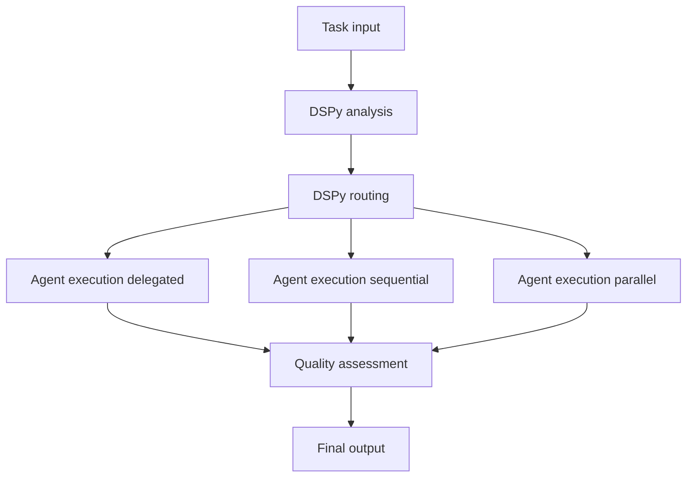

# AGENTS.md

## Overview

`src/agentic_fleet/` contains the DSPy-enhanced runtime that powers the Magentic Fleet orchestration layer. It
instantiates specialists from declarative YAML, compiles DSPy supervisors, streams OpenAI-compatible Responses
events, and wires optional integrations such as Hosted Code Interpreter, Tavily search, or MCP bridges. Treat
this directory as the source of truth for workflow behaviour—adjust configuration through the YAML helpers and
`AgentFactory` instead of hardcoding values.

## Architecture Overview (v0.7.0 FastAPI-First)

The codebase follows a **layered API → Services → Workflows → DSPy → Agents** architecture:

```
┌──────────────────────────────────────────────────────────────────────┐
│                          USER REQUEST FLOW                            │
└──────────────────────────────────────────────────────────────────────┘
                                    │
                                    ▼
┌──────────────────────────────────────────────────────────────────────┐
│                     API LAYER (FastAPI)                               │
│  api/routes/chat.py → middleware.py → deps.py → lifespan.py          │
└──────────────────────────────────────────────────────────────────────┘
                                    │
                                    ▼
┌──────────────────────────────────────────────────────────────────────┐
│                    SERVICES LAYER (Async Business Logic)             │
│  chat_service.py → chat_websocket.py / chat_sse.py                   │
│  workflow_service.py ← optimization_service.py                        │
└──────────────────────────────────────────────────────────────────────┘
                                    │
                                    ▼
┌──────────────────────────────────────────────────────────────────────┐
│                 WORKFLOWS LAYER (5-Phase Orchestration)               │
│  ┌──────────┐  ┌─────────┐  ┌───────────┐  ┌──────────┐  ┌─────────┐ │
│  │ ANALYSIS │→ │ ROUTING │→ │ EXECUTION │→ │ PROGRESS │→ │ QUALITY │ │
│  └──────────┘  └─────────┘  └───────────┘  └──────────┘  └─────────┘ │
└──────────────────────────────────────────────────────────────────────┘
                                    │
                    ┌───────────────┼───────────────┐
                    ▼               ▼               ▼
              ┌──────────┐   ┌──────────┐    ┌──────────┐
              │  DSPy    │   │  Agents  │    │  Tools   │
              │ Modules  │   │  (AF)    │    │          │
              └──────────┘   └──────────┘    └──────────┘
```

## Runtime Layout

| Path                                            | Purpose                                                                                                               |
| ----------------------------------------------- | --------------------------------------------------------------------------------------------------------------------- | --- |
| `main.py`                                       | FastAPI app entrypoint (middleware + lifespan + router mounting).                                                     |
| `api/`                                          | **FastAPI Service Layer**: versioned router aggregation, DI (`deps.py`), lifespan (`lifespan.py`), and route modules. |
| `api/deps.py`                                   | Dependency injection (DB sessions, Auth, Clients)                                                                     |
| `api/lifespan.py`                               | Startup/Shutdown events (initializing DSPy, connections)                                                              |
| `api/middleware.py`                             | FastAPI-level middleware (CORS, Auth, Logging)                                                                        |
| `api/routes/`                                   | Primary API endpoints (chat.py, optimization.py, workflows.py, nlu.py)                                                |
| `api/v1/events/`                                | Event classification + mapping for UI/CLI surfaces.                                                                   |
| `services/`                                     | **Async Business Logic Layer**: bridges API to workflows                                                              |
| `services/agents.py`                            | Factory for creating and managing agents                                                                              |
| `services/conversation.py`                      | Conversation management + persistence                                                                                 |
| `services/chat_sse.py`                          | Server-Sent Events (SSE) streaming logic (recommended)                                                                |
| `services/chat_websocket.py`                    | Legacy WebSocket streaming logic                                                                                      |
| `services/optimization_service.py`              | Bridges API to GEPA optimization loops                                                                                |
| `services/workflows.py`                         | Orchestrates complex multi-agent workflows                                                                            |
| `workflows/`                                    | **Orchestration Layer**: 5-phase pipeline management.                                                                 |
| `workflows/supervisor.py`                       | Main entry point for `DSPyReasoner`, fast-path detection.                                                             |
| `workflows/builder.py`                          | `WorkflowBuilder` configuration and setup.                                                                            |
| `workflows/initialization.py`                   | Bootstraps supervisor contexts, agent catalogs, and shared caches.                                                    |
| `workflows/strategies.py`                       | Execution strategies: `delegated`, `sequential`, and `parallel`.                                                      |
| `workflows/executors/`                          | Logic for specific phases: Analysis, Routing, Execution, Progress, Quality.                                           |
| `workflows/handoff.py`                          | Structured agent handoff management and context logic.                                                                |
| `workflows/context.py`                          | `SupervisorContext` definition for managing state across workflow phases.                                             |
| `workflows/config.py`                           | Dataclasses that mirror `src/agentic_fleet/config/workflow_config.yaml`.                                              |
| `workflows/models.py`                           | Shared data models (AnalysisResult, RoutingPlan, etc.) and types.                                                     |
| `workflows/narrator.py`                         | DSPy-based event narration for user-friendly messages.                                                                |
| `dspy_modules/`                                 | **Intelligence Layer**: DSPy signatures and reasoner implementation.                                                  |
| `dspy_modules/reasoner.py`                      | Central DSPy orchestrator for internal LM calls                                                                       |
| `dspy_modules/signatures.py`                    | GEPA-evolved signatures for task routing and analysis                                                                 |
| `dspy_modules/typed_models.py`                  | Pydantic models for validated, type-safe outputs                                                                      |
| `dspy_modules/assertions.py`                    | Computational constraints for self-correction                                                                         |
| `dspy_modules/optimizer.py`                     | GEPA loop for reflective prompt evolution                                                                             |
| `dspy_modules/refinement.py`                    | BestOfN and iterative improvement logic                                                                               |
| `dspy_modules/nlu.py`                           | DSPy-backed NLU module with lazy-loaded predictors.                                                                   |
| `agents/`                                       | **Runtime Layer**: Agent definitions and MS Agent Framework integration.                                              |
| `agents/coordinator.py`                         | AgentFactory—bridge between DSPy logic and Agent Framework execution.                                                 |
| `agents/base.py`                                | `DSPyEnhancedAgent` mixin with caching, tool awareness, and telemetry hooks.                                          |
| `agents/foundry.py`                             | Azure AI Foundry integration                                                                                          |
| `agents/prompts.py`                             | Centralized prompt modules                                                                                            |
| `tools/`                                        | **Capability Layer**: Tool adapters (Tavily, browser, MCP, code interpreter).                                         |
| `utils/`                                        | **Infrastructure Layer**: Configuration, tracing, storage, caching.                                                   |
| `utils/cfg/`                                    | Configuration loading and environment settings                                                                        |
| `utils/infra/`                                  | Telemetry (OpenTelemetry), tracing, resilience, logging                                                               |
| `utils/storage/`                                | Persistence (Cosmos DB) and conversation history                                                                      |
| `models/`                                       | **Shared Data Models**: Pydantic schemas for API requests/responses.                                                  | \   |
| `evaluation/`                                   | Batch evaluation engine and metrics.                                                                                  |
| `src/agentic_fleet/config/workflow_config.yaml` | Authoritative configuration for DSPy settings, agent rosters, routing thresholds.                                     |
| `data/`                                         | Training examples and evaluation datasets.                                                                            | \   |
| `cli/`                                          | Modular CLI structure with command separation.                                                                        |

## Services Layer (New in v0.7.0)

The services layer provides **async business logic** that bridges API routes to the workflow orchestration:

### Key Files

| Service                   | Purpose                                                        |
| ------------------------- | -------------------------------------------------------------- |
| `conversation.py`         | Conversation management, agent routing decisions               |
| `chat_sse.py`             | Server-Sent Events streaming implementation                    |
| `chat_websocket.py`       | Real-time WebSocket for bidirectional communication (1065 LOC) |
| `workflows.py`            | Entry point for multi-agent workflow orchestration             |
| `optimization_service.py` | Bridges API to GEPA optimization loops                         |

### Design Principle

**Long-running agentic tasks are async**—services ensure FastAPI remains responsive while agents think. The `chat_websocket.py` handles complex cases where an agent may take seconds or minutes to respond.

## Agent Rosters

### Reasoner default team

- **Researcher** — Retrieves context, performs Tavily/Browse lookups, and drafts initial findings (`agents.researcher` in YAML). Runs with low temperature and cached DSPy analysis hints.
- **Analyst** — Uses `HostedCodeInterpreterTool` to validate data, run computations, or manipulate artifacts. Default reasoning strategy is ReAct-style loop.
- **Writer** — Synthesises polished narrative outputs based on accumulated context. Operates with higher cache TTL.
- **Reviewer** — Provides quality gates and structured critiques before final delivery.
- **Quality evaluation** — The workflow terminates at `QualityExecutor`, which uses `DSPyReasoner.assess_quality` to score results and suggest improvements.

### Copilot research surface

- **Copilot Researcher (`agents.copilot_researcher`)** — Specializes in repository-aware assistance. Chains `PackageSearchMCPTool`, `Context7DeepWikiTool`, `TavilyMCPTool`, and `BrowserTool` to gather code snippets, package docs, and deep-wiki context.

### Handoff specialists

- **Planner (`agents.planner`)** — Performs high-effort reasoning to decompose requests into discrete steps. Instructions come from `prompts.planner`.
- **Executor (`agents.executor`)** — Coordinates progress across specialists, escalates blockers (`prompts.executor`).
- **Coder (`agents.coder`)** — Low-temperature technical implementer with Hosted Code Interpreter access (`prompts.coder`).
- **Verifier (`agents.verifier`)** — Validates intermediate outputs, flags regressions (`prompts.verifier`).
- **Generator (`agents.generator`)** — Produces the final user-facing response once intermediate work is verified (`prompts.generator`).

## Agent Factory & YAML wiring

- `agents/coordinator.AgentFactory` is the single entry point for instantiating agent-framework `ChatAgent` instances. It expects declarative configuration from `src/agentic_fleet/config/workflow_config.yaml`.
- Instructions can reference prompt helpers (e.g., `instructions: prompts.executor`). The factory resolves these by calling `agents.prompts.get_<name>_instructions`.
- Tools are resolved in priority order: first via `ToolRegistry` metadata, then by reflecting over classes in `agentic_fleet.tools`.
- Keep behaviour declarative—modify the YAML, prompt helpers, and doc updates together.

## Group Chat & Discussion Mode

The framework supports multi-turn, multi-agent discussions via `DSPyGroupChatManager`:

- **Discussion Mode**: Enabled via `execution_mode: discussion` in the workflow config or CLI.
- **Dynamic Speaker Selection**: The `DSPyReasoner` selects the next speaker based on conversation history.
- **Termination**: The discussion ends when the goal is met or maximum turns reached.
- **Workflow as Agent**: Workflows can participate in group chats as single agents using `workflow.as_agent()`.

## DSPy Reasoner & Workflow Pipeline

1. **Task Intake & Analysis** – `AnalysisExecutor` wraps `DSPyReasoner.analyze_task` and records cache hits.
2. **Routing & Plan Normalization** – `RoutingExecutor` calls `DSPyReasoner.route_task`, normalizes the result, and applies auto-parallelization.
3. **Agent Execution & Streaming** – `run_execution_phase_streaming` fans out agents using Magentic `Executor` instances.
4. **Progress Tracking** – `ProgressExecutor` aggregates intermediate reports, enforces timeout + retry budgets.
5. **Quality Assessment** – `QualityExecutor` uses `DSPyReasoner.assess_quality` to generate a `QualityReport`.

### Workflow Diagram



## Event Streaming Surface

- `api/routes/chat.py` defines the WebSocket/SSE routes; implementation lives in `services/chat_websocket.py` and `services/chat_sse.py`.
- `api/v1/events/mapping.py` classifies workflow events into `StreamEvent` payloads consumed by the UI.
- When adding workflow events, update the mapper tests under `tests/app/events/test_mapping.py`.

## Configuration & Environment

- `src/agentic_fleet/config/workflow_config.yaml` governs DSPy models, GEPA optimization knobs, agent definitions, tool toggles, quality thresholds, tracing, and evaluation settings.
- Required environment variable: `OPENAI_API_KEY`. Optional: `OPENAI_BASE_URL`, `TAVILY_API_KEY`, `DSPY_COMPILE`, `ENABLE_OTEL`, `OTLP_ENDPOINT`.
- Load `.env` for local development; production deployments should inject secrets via managed stores.

## Tools & Integrations

- `ToolRegistry` resolves names declared in YAML to concrete instances with latency + cost hints.
- MCP & research adapters: `PackageSearchMCPTool`, `Context7DeepWikiTool`, `TavilyMCPTool`, `BrowserTool`.
- Tool results can be cached with TTL via the `tool_registry_cache` toggle in `workflow_config.yaml`.
- GEPA optimization (`utils/gepa_optimizer.py`) accelerates DSPy compilation.
- OpenTelemetry tracing hooks in `utils/infra/tracing.py`.
- Cosmos mirrors handled by `utils/storage/cosmos.py`.

## Code Quality & Architecture Improvements

### Modular Workflow Architecture

- **`workflows/executors/` layout** – All executors live under a stable package path.
- **Builder + initialization split** – `workflows/builder.py` focuses on wiring executors, while `workflows/initialization.py` prepares shared caches.
- **Config dataclasses** – `workflows/config.py` and `utils/cfg/` keep the YAML contract type-safe.
- **Streaming helpers** – `services/chat_sse.py` and `services/chat_websocket.py` isolate SSE/WebSocket wiring.

### Enhanced Error Handling

- Exceptions use dedicated types in `workflows/exceptions.py` (`CompilationError`, `ToolError`, etc.).
- `utils/infra/resilience.py` provides retry helpers plus logging context.

### Type Safety

- Protocol definitions in `utils/types.py` for DSPy, agent-framework, and internal interfaces.
- Executors and service layers cast middleware/tool callables defensively.

### Caching Improvements

- Enhanced `TTLCache` in `utils/cache.py` with hit rate tracking (`CacheStats`)
- Incremental cleanup of expired entries for better memory management
- Max size support with LRU eviction policy

### Latency Profiles

- The fleet workflow supports selectable pipeline profiles via `WorkflowConfig.pipeline_profile`:
  - `"full"` (default): 5-stage pipeline (analysis → routing → execution → progress → quality).
  - `"light"`: latency-optimized path for simple tasks; uses heuristic analysis/routing.
- The CLI `run` command enables the light profile automatically when using `--fast`:
  - `agentic-fleet run --fast "Quick question"` → `pipeline_profile="light"`

## CLI & Automation

- `uv run python -m agentic_fleet.cli.console run -m "..."` – Run a single workflow.
- `uv run python -m agentic_fleet.cli.console handoff --interactive` – Explore agent handoffs.
- `uv run agentic-fleet analyze --dataset data/evaluation_tasks.jsonl` – Batch evaluation.
- Entry points `agentic-fleet` or `fleet` wrap the console for shorter commands.

## Testing & Validation

- `make test` / `uv run pytest -v` – Backend tests.
- `make test-config` – Validates YAML wiring and agent imports.
- `make check` – Runs Ruff linter and ty type checker.
- `make qa` – Comprehensive QA: lint, format, type-check, all tests.

## Troubleshooting

- **Missing API keys** – `ValueError: OPENAI_API_KEY is not set`; load `.env` or export the key.
- **Tavily not available** – Researcher falls back to reasoning-only mode if `TAVILY_API_KEY` is absent.
- **Slow DSPy compilation** – Reduce GEPA limits in `workflow_config.yaml` or clear cache.
- **Tool resolution warnings** – Ensure tool names in YAML exist in `ToolRegistry`.
- **No streaming output** – Confirm `workflow.supervisor.enable_streaming` is true.
