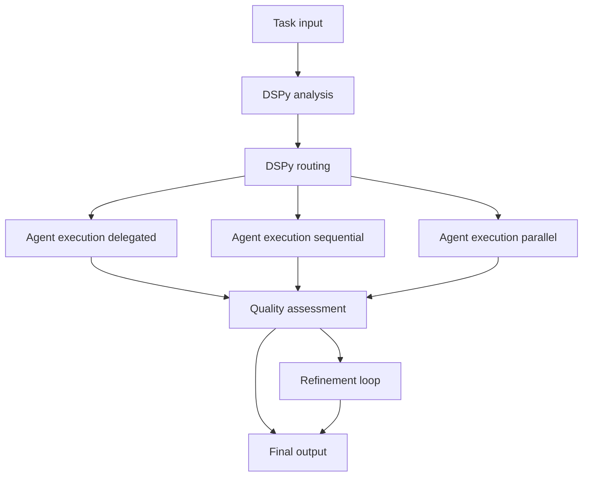

# AGENTS.md

## Overview

`src/agentic_fleet/` contains the DSPy-enhanced runtime that powers the Magentic Fleet orchestration layer. It
instantiates specialists from declarative YAML, compiles DSPy supervisors, streams OpenAI-compatible Responses
events, and wires optional integrations such as Hosted Code Interpreter, Tavily search, or MCP bridges. Treat
this directory as the source of truth for workflow behaviour—adjust configuration through the YAML helpers and
`AgentFactory` instead of hardcoding values.

## Runtime Layout

| Path                                      | Purpose                                                                                                                                                            |
| ----------------------------------------- | ------------------------------------------------------------------------------------------------------------------------------------------------------------------ |
| `cli/console.py`                          | Minimal Typer app that imports and registers commands from `cli/commands/`. Packaged CLI entrypoint via [`agentic_fleet.cli.console:app`](pyproject.toml).         |
| `scripts/manage_cache.py`                 | Utility to inspect or clear the DSPy compilation cache stored under `logs/compiled_supervisor.pkl`.                                                                |
| `agents/`                                 | **Canonical agent layer**: Specialist configuration modules, `coordinator.AgentFactory`, and consolidated prompts (`prompts.py`).                                  |
| `agents/base.py`                          | `DSPyEnhancedAgent` mixin that decorates agent-framework threads with caching, tool awareness, and telemetry hooks.                                                |
| `api/`                                    | **Service Layer**: FastAPI backend, `settings.py` (config), `error_handlers.py`, and database models (`api/db/`).                                                  |
| `workflows/`                              | **Orchestration Layer**: Flattened module structure for workflow management.                                                                                       |
| `workflows/supervisor.py`                 | Main entry point for `DSPyReasoner`, orchestrating analysis, routing, and execution.                                                                               |
| `workflows/builder.py`                    | `WorkflowBuilder` configuration and setup.                                                                                                                         |
| `workflows/initialization.py`             | Bootstraps supervisor contexts, agent catalogs, and shared caches before execution starts.                                                                         |
| `workflows/strategies.py`                 | Execution strategies: `delegated`, `sequential`, and `parallel` (replacing `workflows/execution/*`).                                                               |
| `workflows/executors.py`                  | Logic for specific phases: Analysis, Routing, Execution, Progress, Quality, Judge/Refine (pipeline-profile aware).                                                 |
| `workflows/execution/streaming_events.py` | Server-Sent Events helpers for streaming Magentic workflow updates into the CLI/UI.                                                                                |
| `workflows/handoff.py`                    | Structured agent handoff management and context logic.                                                                                                             |
| `workflows/context.py`                    | `SupervisorContext` definition for managing state across workflow phases.                                                                                          |
| `workflows/config.py`                     | Dataclasses that mirror `config/workflow_config.yaml` (pipeline profile, retry knobs, thresholds).                                                                 |
| `workflows/compilation.py`                | Utilities for compiling DSPy modules, wiring caches, and persisting compiled artifacts.                                                                            |
| `workflows/models.py`                     | Shared data models (AnalysisResult, RoutingPlan, etc.) and types.                                                                                                  |
| `workflows/helpers.py`                    | Pure utility functions for routing normalization and edge case detection.                                                                                          |
| `workflows/messages.py`                   | Message synthesis and artifact extraction utilities.                                                                                                               |
| `workflows/exceptions.py`                 | Workflow-specific exception hierarchy with context-aware error reporting.                                                                                          |
| `dspy_modules/`                           | DSPy signatures and reasoner implementation.                                                                                                                       |
| `dspy_modules/handoff_signatures.py`      | Enhanced DSPy signatures for agent-framework integration.                                                                                                          |
| `dspy_modules/signatures.py`              | Core DSPy signatures: `TaskAnalysis`, `TaskRouting`, `QualityAssessment`, `ProgressEvaluation`.                                                                    |
| `tools/`                                  | Tool adapters (Hosted Code Interpreter, Tavily search, browser automation, MCP bridge) resolved by the tool registry.                                              |
| `utils/`                                  | Configuration loader, DSPy compiler cache, GEPA optimizer, history manager, telemetry bootstrap, models, tracing, `ToolRegistry`, and async compilation utilities. |
| `evaluation/`                             | Batch evaluation engine and metrics used by CLI commands and scripts.                                                                                              |
| `config/workflow_config.yaml`             | Authoritative configuration for DSPy settings, agent rosters, routing thresholds, quality gates, and tool toggles.                                                 |
| `data/`                                   | Training examples (`supervisor_examples.json`) and evaluation datasets consumed by DSPy compilation and batch runs.                                                |
| `scripts/`                                | Helpers for history analysis, evaluation dataset generation, and self-improvement loops.                                                                           |
| `cli/`                                    | Modular CLI structure with command separation for better maintainability.                                                                                          |
| `cli/commands/`                           | Individual command modules: `run.py`, `handoff.py`, `analyze.py`, `benchmark.py`, `agents.py`, `history.py`, `optimize.py`, `improve.py`, `evaluate.py`.           |
| `cli/runner.py`                           | `WorkflowRunner` class for executing workflows from CLI.                                                                                                           |
| `cli/display.py`                          | Display utilities for rich console output.                                                                                                                         |
| `cli/utils.py`                            | CLI helper functions (tracing initialization, resource path resolution).                                                                                           |
| `ui/`                                     | Thin React/Vite bundle that visualizes streaming workflow output (used by `make frontend-dev`).                                                                    |

## Agent Rosters

### Reasoner default team

- **Researcher** — Retrieves context, performs Tavily/Browse lookups, and drafts initial findings (`agents.researcher` in YAML). Runs with low temperature and cached DSPy analysis hints, making it the default source of search context for downstream agents.
- **Analyst** — Uses `HostedCodeInterpreterTool` to validate data, run computations, or manipulate artifacts. Default reasoning strategy is the ReAct-style loop configured in `workflow_config.yaml` (see `agents.analyst.strategy`).
- **Writer** — Synthesises polished narrative outputs based on accumulated context and intermediate results. Operates with a higher cache TTL so multi-turn tasks reuse tonality and structure.
- **Reviewer** — Provides quality gates and structured critiques before final delivery. It does lightweight reasoning to keep latency down.
- **Judge (virtual persona)** — The quality stage is powered by the `judge_model` declared under `workflow.quality`. `JudgeRefineExecutor` spins up this persona on demand to issue scores, parse reasoning, and trigger refinement when thresholds are missed.

### Copilot research surface

- **Copilot Researcher (`agents.copilot_researcher`)** — Specializes in repository-aware assistance. It chains `PackageSearchMCPTool`, `Context7DeepWikiTool`, `TavilyMCPTool`, and `BrowserTool` to gather code snippets, package docs, and deep-wiki context before handing results to the main workflow or GitHub Copilot surfaces.

### Handoff specialists

- **Planner (`agents.planner`)** — Performs high-effort reasoning to decompose the request into discrete steps and assign ownership. Instructions come from `prompts.planner`.
- **Executor (`agents.executor`)** — Coordinates progress across specialists, escalates blockers, and tracks plan completion (`prompts.executor`).
- **Coder (`agents.coder`)** — Low-temperature technical implementer with Hosted Code Interpreter access for patches and prototypes (`prompts.coder`).
- **Verifier (`agents.verifier`)** — Validates intermediate outputs, flags regressions, and drives refinement loops (`prompts.verifier`).
- **Generator (`agents.generator`)** — Produces the final user-facing response once intermediate work is verified (`prompts.generator`).

Updates to any roster require concurrent changes in `config/workflow_config.yaml`, the relevant `agents/*.py` module, prompt modules, and coverage in the workflow/evaluation tests.

## Agent Factory & YAML wiring

- `agents/coordinator.AgentFactory` is the single entry point for instantiating agent-framework `ChatAgent` instances. It expects declarative configuration (usually from `config/workflow_config.yaml`) and respects the `ENABLE_DSPY_AGENTS` environment variable so you can globally toggle DSPy augmentation without touching YAML.
- Instructions can reference prompt helpers (e.g., `instructions: prompts.executor`). The factory resolves these by calling `agents.prompts.get_<name>_instructions`, ensuring prompts stay centralized.
- Tools are resolved in priority order: first via `ToolRegistry` metadata (which includes cached latency/cost hints), then by reflecting over classes exposed in `agentic_fleet.tools`. This makes newly added adapters (Hosted Code Interpreter, Browser automation, MCP bridges, etc.) immediately available to YAML without bespoke glue code.
- `create_workflow_agents(...)` remains as a backwards-compatible shim. It simply loads YAML, applies optional model overrides, and defers to `AgentFactory`, so older modules can still call a single helper while the new factory handles validation and telemetry.
- `get_default_agent_metadata()` exposes lightweight capability descriptions for UI or CLI listings; it mirrors the YAML roster and includes the Judge persona so consumer surfaces do not need to instantiate every agent up front.

Keep behaviour declarative—modify the YAML, prompt helpers, and doc updates together so the running roster, documentation, and evaluation suites stay in lock-step.

## DSPy Reasoner & Workflow Pipeline

1. **Task Intake & Analysis** – `workflows.executors.AnalysisExecutor` wraps `DSPyReasoner.analyze_task` and records cache hits in `SupervisorContext.analysis_cache`. It automatically falls back to heuristic analysis for `/fast` runs (`pipeline_profile="light"`) or when DSPy is unavailable.
2. **Routing & Plan Normalization** – `RoutingExecutor` calls `DSPyReasoner.route_task`, normalizes the result via `workflows.helpers.normalize_routing_decision`, and applies auto-parallelization thresholds. Edge cases are detected and logged so the quality stage can reason about risky plans.
3. **Agent Execution & Streaming** – `run_execution_phase_streaming` (in `workflows.strategies` + `workflows.execution.streaming_events`) fans out the selected agents using Magentic `Executor` instances. `DSPyEnhancedAgent` metadata attaches tool plans (`tool_plan/tool_goals/latency_budget`) generated by the reasoner and surfaces them over Server-Sent Events to the CLI/UI.
4. **Progress Tracking** – `ProgressExecutor` aggregates intermediate reports, enforces timeout + retry budgets from `workflow.execution`, and annotates `SupervisorContext.latest_phase_status` so telemetry can flag slow or stalled runs.
5. **Quality & Judge Refinement** – `QualityExecutor` composes criteria via `workflows.helpers.get_quality_criteria`, then `JudgeRefineExecutor` streams the Judge persona reasoning (powered by `workflow.quality.judge_model`). Refinement is only triggered when `quality_threshold`/`refinement_threshold` are missed and the configured `max_refinement_rounds`/`refinement_min_improvement` gates allow it.

### Workflow Diagram

### Latency and Slow Phases

Typical bottlenecks and tuning actions:

- DSPy compilation on first run
  - Set `DSPY_COMPILE=false` in env when iterating quickly, or rely on cache; clear via [`scripts/manage_cache.py`](src/agentic_fleet/scripts/manage_cache.py)
  - Reduce GEPA effort in [`workflow_config.yaml`](config/workflow_config.yaml): `gepa_max_metric_calls`, `max_bootstrapped_demos` (defaults tuned lower)
- Analysis cache warm-up
  - `SupervisorContext.analysis_cache` memoizes DSPy analysis payloads; prime it by running common tasks once per session.
  - The cache key is the stripped task string, so normalize prompts when possible to increase reuse.
- Tool calls with network latency (OpenAI, Tavily, Hosted Code Interpreter)
  - Prefer lighter Reasoner model; e.g. `dspy.model: gpt-5-mini`
  - Pre-analysis tool usage is supported and cached via `ToolRegistry` result cache
- Judge/refinement loops
  - Set `quality.max_refinement_rounds: 1`, `judge_reasoning_effort: minimal`, `judge_timeout_seconds` to cap cost
- Parallel fan-out synthesis
  - Cap `execution.max_parallel_agents` to a small number
  - Enable streaming to surface progress early
- History and tracing I/O
  - Reduce verbosity during production runs
  - Batch writes if needed

Slow-phase detection: per-phase timing is recorded in `phase_timings` (analysis/routing/progress). A `slow_execution_threshold` guardrail logs when a phase exceeds the threshold.

## Configuration & Environment

- `config/workflow_config.yaml` governs DSPy models, GEPA optimization knobs, agent definitions, tool toggles, quality thresholds, tracing, and evaluation settings.
- Required environment variable: `OPENAI_API_KEY`. Optional: `OPENAI_BASE_URL`, `TAVILY_API_KEY`, `DSPY_COMPILE` (force recompilation), `ENABLE_OTEL`, `OTLP_ENDPOINT`, plus integration-specific credentials (Mem0, Cosmos DB, etc.).
- Load `.env` for local development; production deployments should inject secrets via managed stores or environment configuration.
- Keep behaviour declarative—reference prompt modules (`prompts.executor`, etc.) rather than embedding instruction strings inline.

## Tools & Integrations

- `ToolRegistry` resolves names declared in YAML to concrete instances and now annotates each tool with latency + cost hints (`low|medium|high`). The resolution order is registry metadata → `agentic_fleet.tools` module, so adding a new adapter only requires registering it once.
- MCP & research adapters:
  - `PackageSearchMCPTool` – surfaces package metadata and version history directly from MCP servers.
  - `Context7DeepWikiTool` – fetches Context7 wiki content for deep research tasks.
  - `TavilyMCPTool` – bridges the Tavily MCP endpoint for enterprise environments.
  - `BrowserTool` – lightweight, read-only browser automation for capturing raw page text.
    These power the `copilot_researcher` persona and can be reused by other agents via YAML.
- Tool results can be cached with TTL via the `tool_registry_cache` toggle in `workflow_config.yaml`, and `tool_usage_tracking` emits structured telemetry for later analysis.
- GEPA optimization (`utils/gepa_optimizer.py`) accelerates DSPy compilation and supports history-informed reruns.
- OpenTelemetry tracing hooks live in `utils/tracing.py` and align with AI Toolkit collectors.
- History capture and analytics live in `utils/history_manager.py` and the `scripts/` helpers.
- Cosmos mirrors are handled by `utils/cosmos.py`: set `AGENTICFLEET_USE_COSMOS=1` plus `AZURE_COSMOS_ENDPOINT` and either `AZURE_COSMOS_KEY` or `AZURE_COSMOS_USE_MANAGED_IDENTITY=1` to enable best-effort writes to `workflowRuns`, `agentMemory`, `dspyExamples`, `dspyOptimizationRuns`, and `cache`. Partition keys follow best practices (`/workflowId`, `/userId`, `/cacheKey`), and the helper never blocks if the account is unreachable.

## Code Quality & Architecture Improvements

### Modular Workflow Architecture

- **`workflows.executors` consolidation** – All analysis, routing, execution, progress, quality, and judge phases now live in a single module, making it easier to reason about pipeline-profile branching and telemetry.
- **Builder + initialization split** – `workflows.builder` focuses on wiring executors, while `workflows.initialization` prepares shared caches, agent catalogs, and configuration defaults.
- **Config dataclasses** – `workflows.config` and `utils.config_schema` keep the YAML contract type-safe, so pipeline-profile toggles and retry knobs propagate reliably through the CLI.
- **Streaming helpers** – `workflows.execution.streaming_events` isolates SSE wiring, keeping `workflows.strategies` focused on execution semantics (delegated/sequential/parallel).
- **Shared helpers** – `workflows.helpers` centralizes routing normalization, judge parsing, refinement prompts, and edge-case detection—removing the need for bespoke utility modules per executor.

### Enhanced Error Handling

- Exceptions use the dedicated types in `workflows.exceptions` (`CompilationError`, `ToolError`, etc.), enabling granular retries and clearer user-facing errors.
- `utils.error_utils` and `utils.resilience` provide retry helpers plus logging context for both DSPy calls and external tools.

### Type Safety

- Protocol definitions in `utils.types.py` for DSPy, agent-framework, and internal interfaces.
- Type aliases and runtime-checkable protocols improve IDE support and reduce `type: ignore` usage.
- Executors and service layers now cast middleware/tool callables defensively to satisfy Ty/mypy without suppressing errors.

### Caching Improvements

- Enhanced `TTLCache` in `utils/cache.py` with hit rate tracking (`CacheStats`)
- Incremental cleanup of expired entries for better memory management
- Max size support with LRU eviction policy
- Cache statistics for monitoring and optimization

### Code Organization

- **CLI Modularization**: Commands separated into individual modules in `cli/commands/` for better maintainability
- **Minimal Entry Points**: `cli/console.py` reduced to ~61 lines, focusing on command registration
- CLI module structure: `cli/runner.py` (WorkflowRunner), `cli/display.py` (display utilities), `cli/utils.py` (helpers)
- Constants centralized in `utils/constants.py` (magic numbers, thresholds, defaults)
- Async compilation support in `utils/async_compiler.py` for non-blocking workflow initialization

### Performance Optimizations

- Background DSPy compilation to avoid blocking workflow startup
- Improved cache invalidation with granular hash-based tracking
- Periodic cache cleanup to reduce memory footprint
- Reduced code duplication through shared execution strategies

### Latency Profiles

- The fleet workflow supports selectable pipeline profiles via `WorkflowConfig.pipeline_profile`:
  - `"full"` (default): full multi-stage pipeline (analysis → routing → execution → progress → quality → judge/refinement).
  - `"light"`: latency-optimized path for simple tasks; uses heuristic analysis/routing and skips DSPy progress/quality evaluation and judge/refinement.
- The CLI `run` command enables the light profile automatically when using `--fast`:
  - `agentic-fleet run --fast "Quick question"` → `pipeline_profile="light"`, progress/quality eval and judge/refinement disabled.
- Simple-task detection in light profile is heuristic and currently based on word count (`simple_task_max_words`, default 40); it can be tuned via `workflow.supervisor.simple_task_max_words` in `config/workflow_config.yaml`.

### DSPy Optimization Usage

- DSPy is configured once per process via `utils.dspy_manager.configure_dspy_settings`, using a shared LM (e.g. `openai/gpt-5-mini`) and optional prompt caching.
- Supervisor analysis and routing are backed by `DSPyReasoner`:
  - `AnalysisExecutor` calls `DSPyReasoner.analyze_task` to get a structured breakdown (complexity, steps, capabilities).
  - `RoutingExecutor` calls `DSPyReasoner.route_task` with team + tool descriptions to leverage tool-aware routing and an enhanced signature that can emit an ordered tool plan.
- Judge / quality evaluation:
  - `QualityExecutor` composes criteria from `workflows.helpers.get_quality_criteria` and feeds them into `DSPyReasoner.assess_quality`.
  - `JudgeRefineExecutor` streams intermediate judge evaluations and respects `judge_timeout_seconds` with minimal reasoning effort; refinement is gated by thresholds to control cost.

## CLI & Automation

- `uv run python -m agentic_fleet.cli.console run -m "..."` – Run a single workflow (streamed or buffered).
- `uv run python -m agentic_fleet.cli.console handoff --interactive` – Explore agent handoffs with `HandoffManager`.
- `uv run python -m agentic_fleet.cli.console analyze --dataset data/evaluation_tasks.jsonl` – Batch evaluation with metrics logged to `logs/evaluation/`.
- `uv run python -m agentic_fleet.scripts.manage_cache --info|--clear` – Inspect or clear DSPy compilation cache.
- Entry points `agentic-fleet` or `fleet` wrap the console for shorter commands.
- `make analyze-history` – Analyze workflow execution history using `scripts/analyze_history.py`.
- `make self-improve` – Run self-improvement analysis using `scripts/self_improve.py`.

## Testing & Validation

- `make test` / `uv run pytest -v` – Backend tests (stubs avoid external API calls).
- `make test-config` – Validates YAML wiring and agent imports.
- `make check` – Runs Ruff linter and ty type checker to enforce style and typing.
- `make qa` – Comprehensive QA: lint, format, type-check, backend tests, and frontend tests.

## Troubleshooting

- **Missing API keys** – `ValueError: OPENAI_API_KEY is not set`; load `.env` or export the key before invoking workflows.
- **Tavily not available** – The researcher falls back to reasoning-only mode if `TAVILY_API_KEY` is absent; expect reduced context gathering.
- **Slow DSPy compilation** – Reduce GEPA limits in `workflow_config.yaml` (`gepa_max_metric_calls`, `max_bootstrapped_demos`) or clear cache before reruns.
- **Tool resolution warnings** – Ensure tool names in YAML exist in `ToolRegistry` and relevant extras are installed.
- **No streaming output** – Confirm `workflow.supervisor.enable_streaming` is true and tracing exporters are not throwing OTLP errors (suppress via logging settings if needed).
