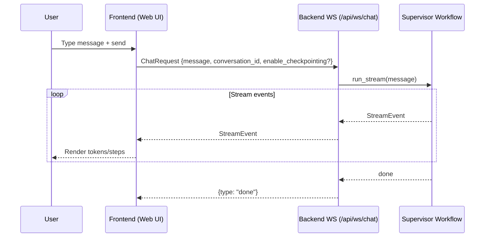
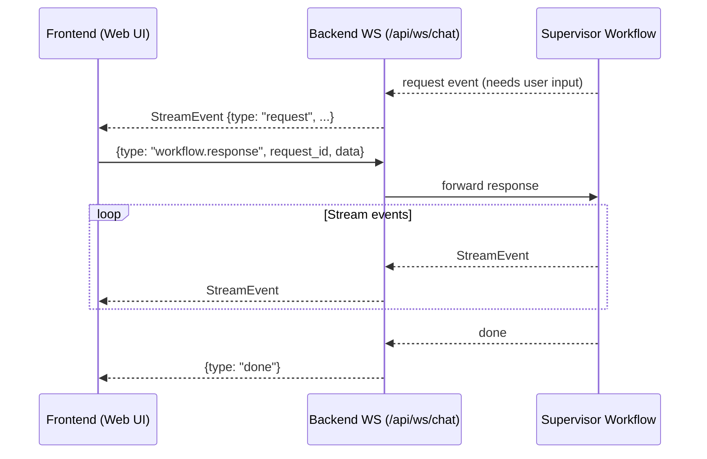
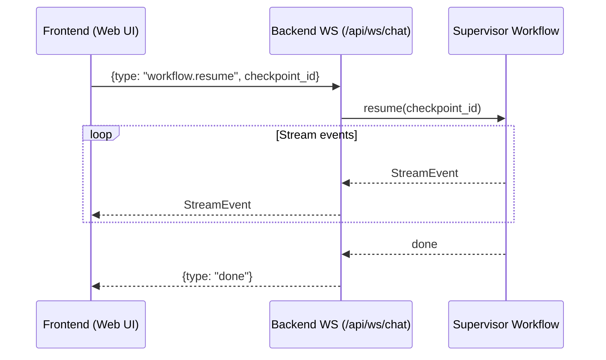

# Frontend Guide

## Overview

AgenticFleet includes a React-based web interface for interacting with the multi-agent system. The frontend provides:

- Real-time chat interface with streaming responses
- Workflow visualization showing agent orchestration
- Chain-of-thought and reasoning display
- Conversation history management

## Quick Start

### Starting the Frontend

The easiest way to start the frontend is with the CLI:

```bash
# Start both backend and frontend
agentic-fleet dev

# Or using Make
make dev
```

This starts:

- **Backend**: http://localhost:8000 (FastAPI)
- **Frontend**: http://localhost:5173 (Vite dev server)

### Custom Ports

```bash
# Custom ports via CLI
agentic-fleet dev --backend-port 8080 --frontend-port 3000

# Backend only (for API development)
agentic-fleet dev --no-frontend

# Frontend only (when backend is already running)
agentic-fleet dev --no-backend
```

### Using Make

```bash
make dev            # Both servers
make backend        # Backend only (port 8000)
make frontend-dev   # Frontend only (port 5173)
```

## Features

### Chat Interface

The main chat interface allows you to:

- Send messages to the multi-agent system
- View streaming responses in real-time
- See which agents are processing your request
- Access conversation history

### Workflow Visualization

During message processing, the UI displays:

- **Orchestrator thoughts**: Routing decisions, task analysis
- **Agent activity**: Which agents are working and their outputs
- **Reasoning steps**: Chain-of-thought reasoning (for GPT-5 models)
- **Quality scores**: Assessment of response quality

### Conversation Management

- Create new conversations
- Switch between existing conversations
- Conversations persist across sessions (stored in `.var/data/conversations.json`)

## Configuration

### Environment Variables

Frontend-specific configuration in `.env`:

```bash
# Backend API URL (for production deployments)
VITE_API_URL=http://localhost:8000
```

The `/api` prefix is added automatically by the frontend.

### CORS Configuration

For production deployments, configure allowed origins in the backend:

```bash
# In .env
CORS_ALLOWED_ORIGINS=https://yourdomain.com,https://app.yourdomain.com
```

## Development

### Installing Dependencies

```bash
# From project root
make frontend-install

# Or directly
cd src/frontend && npm install
```

### Running Tests

```bash
# Unit tests
make test-frontend

# E2E tests (requires dev servers running)
make test-e2e
```

### Linting and Formatting

```bash
make frontend-lint    # ESLint
make frontend-format  # Prettier
```

### Building for Production

```bash
make build-frontend
```

This builds the frontend and copies assets to `src/agentic_fleet/ui/` for serving by the backend.

## Architecture

The frontend uses:

- **React 19** with TypeScript
- **Vite** for development and building
- **Tailwind CSS** for styling
- **shadcn/ui** for UI components
- **WebSocket** for real-time streaming

### Key Files

| Path                           | Purpose                                   |
| ------------------------------ | ----------------------------------------- |
| `src/frontend/src/App.tsx`     | Main application component                |
| `hooks/useChat.ts`             | Chat state management and WebSocket logic |
| `api/client.ts`                | REST API client                           |
| `api/types.ts`                 | TypeScript type definitions               |
| `components/ChatMessage.tsx`   | Message rendering component               |
| `components/workflow/`         | Workflow visualization components         |
| `lib/reconnectingWebSocket.ts` | WebSocket with auto-reconnection          |

### WebSocket Protocol

The frontend communicates with the backend via WebSocket at `/api/ws/chat`:

1. Client connects and sends a `ChatRequest` JSON payload (new run)
2. Server streams `StreamEvent` messages
3. If the workflow emits a human-in-the-loop request, the client can reply with a `workflow.response` message
4. Client can send `{"type": "cancel"}` to abort
5. Server sends `{"type": "done"}` when complete

Supported client message types:

- **New run**: `ChatRequest` (includes `message` and optional `enable_checkpointing`)
- **Resume**: `{"type": "workflow.resume", "checkpoint_id": "..."}`
- **HITL response**: `{"type": "workflow.response", ... }`
- **Cancel**: `{"type": "cancel"}`

Checkpoint semantics (agent-framework):

- `checkpoint_id` is **resume-only** (message XOR checkpoint_id).
- For new runs, checkpointing is enabled via `enable_checkpointing` (the server configures checkpoint storage).
- To resume, send `workflow.resume` with a `checkpoint_id` and **do not** send a `message`.

### Message Flow Diagrams

These diagrams show the expected message flow for the web UI. They are intentionally aligned with agent-framework semantics:

- **New run** uses `message` (and may opt into `enable_checkpointing`)
- **Resume** uses `checkpoint_id` only
- **HITL** uses `workflow.response` to unblock execution when the server emits a request

#### New Run (Streaming)



#### Human-in-the-Loop (HITL) Request + Response



#### Resume from a Checkpoint



See `src/frontend/AGENTS.md` for detailed frontend architecture documentation.

## Troubleshooting

### Frontend Not Loading

1. Ensure dependencies are installed: `make frontend-install`
2. Check that port 5173 is available
3. Verify backend is running if using `--no-backend`

### WebSocket Connection Failed

1. Check that backend is running on the expected port
2. Verify CORS settings allow your origin
3. Check browser console for specific errors

### Styles Not Applying

1. Run `npm install` to ensure Tailwind is installed
2. Check `tailwind.config.js` for correct content paths

### Hot Reload Not Working

1. Restart the dev server: `agentic-fleet dev`
2. Clear browser cache
3. Check for syntax errors in modified files

## Next Steps

- See [Quick Reference](../guides/quick-reference.md) for all commands
- Read [Frontend AGENTS.md](../../src/frontend/AGENTS.md) for detailed architecture
- Check [Configuration](configuration.md) for backend settings
