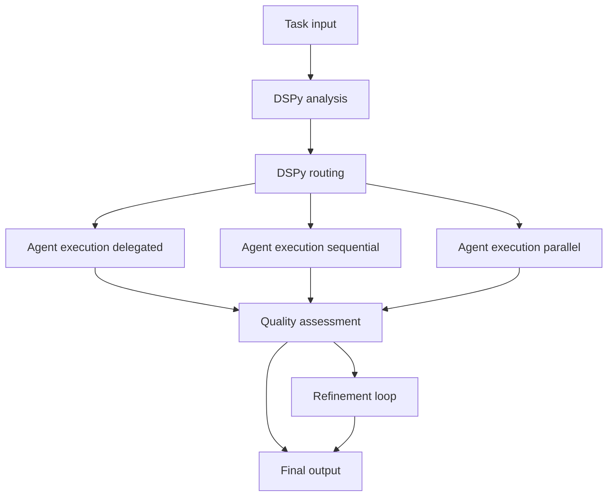

# AGENTS.md

## Overview

`src/agentic_fleet/` contains the DSPy-enhanced runtime that powers the Magentic Fleet orchestration layer. It
instantiates specialists from declarative YAML, compiles DSPy supervisors, streams OpenAI-compatible Responses
events, and wires optional integrations such as Hosted Code Interpreter, Tavily search, or MCP bridges. Treat
this directory as the source of truth for workflow behaviour—adjust configuration through the YAML helpers and
`AgentFactory` instead of hardcoding values.

## Runtime Layout

| Path                                  | Purpose                                                                                                                                                                                         |
| ------------------------------------- | ----------------------------------------------------------------------------------------------------------------------------------------------------------------------------------------------- |
| `cli/console.py`                      | Minimal Typer app that imports and registers commands from `cli/commands/`. Packaged CLI entrypoint via [`agentic_fleet.cli.console:app`](pyproject.toml).                                      |
| `scripts/manage_cache.py`             | Utility to inspect or clear the DSPy compilation cache stored under `logs/compiled_supervisor.pkl`.                                                                                             |
| `agents/`                             | **Canonical agent layer**: Specialist configuration modules, `coordinator.AgentFactory` for YAML-based agent creation, and `create_workflow_agents` for default workflow agents.                |
| `prompts/`                            | Prompt modules exposing `get_instructions()` for planner/executor/coder/verifier/generator specialists.                                                                                         |
| `workflows/`                          | Core workflow orchestration using agent-framework WorkflowBuilder with DSPy-enhanced executors.                                                                                                 |
| `workflows/supervisor_workflow.py`    | Factory function and type alias for `FleetWorkflowAdapter` (the agent-framework workflow implementation).                                                                                       |
| `workflows/fleet/`                    | Fleet workflow implementation: `adapter.py` (FleetWorkflowAdapter), `builder.py` (WorkflowBuilder setup), executors (analysis, routing, execution, progress, quality, judge_refine).            |
| `workflows/config.py`                 | `WorkflowConfig` dataclass and configuration helpers.                                                                                                                                           |
| `workflows/execution/`                | Execution strategy modules: `delegated.py`, `sequential.py`, `parallel.py` (streaming and non-streaming variants).                                                                              |
| `workflows/quality/`                  | Quality assessment modules: `assessor.py` (quality/judge phases), `criteria.py` (dynamic criteria), `refiner.py` (refinement).                                                                  |
| `workflows/routing/`                  | Routing modules: `helpers.py` (normalization, edge case detection), `subtasks.py` (subtask preparation).                                                                                        |
| `workflows/shared/`                   | Shared workflow utilities: typed models (AnalysisResult, RoutingPlan, etc.) and conversion helpers.                                                                                             |
| `workflows/utils.py`                  | Shared workflow utilities: result synthesis, artifact extraction, work estimation, OpenAI client creation.                                                                                      |
| `workflows/handoff_manager.py`        | Structured agent handoff management with context, artifacts, and quality criteria.                                                                                                              |
| `workflows/exceptions.py`             | Workflow-specific exception hierarchy with context-aware error reporting.                                                                                                                       |
| `dspy_modules/`                       | DSPy signatures and supervisor implementation.                                                                                                                                                  |
| `dspy_modules/supervisor.py`          | `DSPySupervisor` module orchestrating analysis, routing, progress, and quality using DSPy signatures.                                                                                           |
| `dspy_modules/workflow_signatures.py` | Enhanced DSPy signatures for agent-framework integration: `EnhancedTaskRouting`, `JudgeEvaluation`, `WorkflowHandoffDecision`.                                                                  |
| `dspy_modules/signatures.py`          | Core DSPy signatures: `TaskAnalysis`, `TaskRouting`, `QualityAssessment`, `ProgressEvaluation`.                                                                                                 |
| `dspy_modules/handoff_signatures.py`  | Handoff-specific DSPy signatures: `HandoffDecision`, `HandoffProtocol`, `HandoffQualityAssessment`.                                                                                             |
| `tools/`                              | Tool adapters (Hosted Code Interpreter, Tavily search, browser automation, MCP bridge) resolved by the tool registry.                                                                           |
| `utils/`                              | Configuration loader, DSPy compiler cache, GEPA optimizer, history manager, telemetry bootstrap, models, tracing, `ToolRegistry`, type definitions, constants, and async compilation utilities. |
| `evaluation/`                         | Batch evaluation engine and metrics used by CLI commands and scripts.                                                                                                                           |
| `config/workflow_config.yaml`         | Authoritative configuration for DSPy settings, agent rosters, routing thresholds, quality gates, and tool toggles.                                                                              |
| `data/`                               | Training examples (`supervisor_examples.json`) and evaluation datasets consumed by DSPy compilation and batch runs.                                                                             |
| `scripts/`                            | Helpers for history analysis, evaluation dataset generation, and self-improvement loops.                                                                                                        |
| `cli/`                                | Modular CLI structure with command separation for better maintainability.                                                                                                                       |
| `cli/commands/`                       | Individual command modules: `run.py`, `handoff.py`, `analyze.py`, `benchmark.py`, `agents.py`, `history.py`, `optimize.py`, `improve.py`, `evaluate.py`.                                        |
| `cli/runner.py`                       | `WorkflowRunner` class for executing workflows from CLI.                                                                                                                                        |
| `cli/display.py`                      | Display utilities for rich console output.                                                                                                                                                      |
| `cli/utils.py`                        | CLI helper functions (tracing initialization, resource path resolution).                                                                                                                        |

## Agent Rosters

### Supervisor default team

- **Researcher** — Retrieves context, performs web search (via `TavilySearchTool`), and drafts initial findings. Uses **ReAct** strategy for autonomous tool loops.
- **Analyst** — Uses the Hosted Code Interpreter to validate data, run computations, or manipulate artifacts. Uses **Program of Thought** (PoT) for code-based reasoning.
- **Writer** — Synthesises polished narrative outputs based on accumulated context and intermediate results.
- **Reviewer** — Provides quality gates and structured critiques before final delivery.

### Handoff specialists

- **Planner (`agents.planner`)** — Performs high-effort reasoning to decompose the request into discrete steps and assign ownership.
- **Executor (`agents.executor`)** — Coordinates progress across specialists, escalates blockers, and tracks plan completion.
- **Coder (`agents.coder`)** — Low-temperature technical implementer with Hosted Code Interpreter access for patches and prototypes.
- **Verifier (`agents.verifier`)** — Validates intermediate outputs, flags regressions, and drives refinement loops.
- **Generator (`agents.generator`)** — Produces the final user-facing response once intermediate work is verified.

Updates to any roster require concurrent changes in `config/workflow_config.yaml`, the relevant `agents/*.py` module, prompt modules, and coverage in the workflow/evaluation tests.

## DSPy Supervisor & Workflow Pipeline

1. **Task Analysis** – `DSPySupervisor.analyze_task` extracts goals, constraints, and tooling hints using DSPy `ChainOfThought` signatures (`TaskAnalysis`, `ToolAwareTaskAnalysis`).
2. **Task Routing** – `DSPySupervisor.route_task` selects agents, execution mode (delegated/sequential/parallel), and tool requirements using `EnhancedTaskRouting` (workflow-aware) or `TaskRouting` (standard). The enhanced signature now emits a compact, ReAct-friendly tool plan.
3. **Agent Execution** – Fleet workflow (`FleetWorkflowAdapter`) executes the plan via agent-framework `WorkflowBuilder` and executors. Agents are initialized with specific reasoning strategies (e.g., ReAct, PoT) via `DSPyEnhancedAgent` to handle complex subtasks autonomously. A lightweight `decide_tools(...)` method in the DSPy supervisor surfaces an ordered `tool_plan`, `tool_goals`, and `latency_budget` that are attached to execution metadata and can guide tool usage.
4. **Quality Assessment** – `DSPySupervisor.assess_quality` uses `JudgeEvaluation` signature (with task-specific criteria) or `QualityAssessment` (standard) to score results; sub‑threshold scores trigger refinement loops or judge-based reviews.

### Workflow Diagram

### Latency and Slow Phases

Typical bottlenecks and tuning actions:

- DSPy compilation on first run
  - Set `DSPY_COMPILE=false` in env when iterating quickly, or rely on cache; clear via [`scripts/manage_cache.py`](src/agentic_fleet/scripts/manage_cache.py)
  - Reduce GEPA effort in [`workflow_config.yaml`](config/workflow_config.yaml): `gepa_max_metric_calls`, `max_bootstrapped_demos` (defaults tuned lower)
- Tool calls with network latency (OpenAI, Tavily, Hosted Code Interpreter)
  - Prefer lighter Supervisor model; e.g. `dspy.model: gpt-5-mini`
  - Pre-analysis tool usage is supported and cached via `ToolRegistry` result cache
- Judge/refinement loops
  - Set `quality.max_refinement_rounds: 1`, `judge_reasoning_effort: minimal`, `judge_timeout_seconds` to cap cost
- Parallel fan-out synthesis
  - Cap `execution.max_parallel_agents` to a small number
  - Enable streaming to surface progress early
- History and tracing I/O
  - Reduce verbosity during production runs
  - Batch writes if needed

Slow-phase detection: per-phase timing is recorded in `phase_timings` (analysis/routing/progress). A `slow_execution_threshold` guardrail logs when a phase exceeds the threshold.

## Configuration & Environment

- `config/workflow_config.yaml` governs DSPy models, GEPA optimization knobs, agent definitions, tool toggles, quality thresholds, tracing, and evaluation settings.
- Required environment variable: `OPENAI_API_KEY`. Optional: `OPENAI_BASE_URL`, `TAVILY_API_KEY`, `DSPY_COMPILE` (force recompilation), `ENABLE_OTEL`, `OTLP_ENDPOINT`, plus integration-specific credentials (Mem0, Cosmos DB, etc.).
- Load `.env` for local development; production deployments should inject secrets via managed stores or environment configuration.
- Keep behaviour declarative—reference prompt modules (`prompts.executor`, etc.) rather than embedding instruction strings inline.

## Tools & Integrations

- Tool registry resolves names declared in YAML to concrete instances (`HostedCodeInterpreterTool`, `TavilySearchTool`, browser automation, MCP adapters) and now exposes concise tool descriptions with latency hints (`low|medium|high`).
- Tool results are cached with TTL to reduce repeat network calls; cache stats are available for tuning.
- GEPA optimization (`utils/gepa_optimizer.py`) accelerates DSPy compilation and supports history-informed reruns.
- OpenTelemetry tracing hooks live in `utils/tracing.py` and align with AI Toolkit collectors.
- History capture and analytics live in `utils/history_manager.py` and the `scripts/` helpers.
- Cosmos mirrors are handled by `utils/cosmos.py`: set `AGENTICFLEET_USE_COSMOS=1` plus `AZURE_COSMOS_ENDPOINT` and either `AZURE_COSMOS_KEY` or `AZURE_COSMOS_USE_MANAGED_IDENTITY=1` to enable best-effort writes to `workflowRuns`, `agentMemory`, `dspyExamples`, `dspyOptimizationRuns`, and `cache`. Partition keys follow best practices (`/workflowId`, `/userId`, `/cacheKey`), and the helper never blocks if the account is unreachable.

## Code Quality & Architecture Improvements

### Modular Workflow Architecture

- **Refactored `supervisor_workflow.py`**: Reduced from 2,239 lines to ~1,409 lines (37% reduction) by extracting functionality into focused modules
- **Execution Strategies**: Separated into `workflows/execution/` with dedicated modules for delegated, sequential, and parallel execution (streaming and non-streaming)
- **Quality Assessment**: Modularized into `workflows/quality/` with separate concerns for assessment, criteria generation, and refinement
- **Routing Logic**: Extracted to `workflows/routing/` for better separation of routing decisions and subtask preparation
- **Unified Agent Layer**: All agent creation consolidated in `agents/` package (`AgentFactory` for YAML-based, `create_workflow_agents` for default workflow agents)
- **Shared Utilities**: Common workflow functions moved to `workflows/utils.py` for reusability

### Enhanced Error Handling

- Comprehensive exception hierarchy in `workflows/exceptions.py` with context-aware error reporting
- Specific exceptions: `CompilationError`, `CacheError`, `ValidationError`, `TimeoutError`, `ToolError`
- Structured error context for better debugging and monitoring

### Type Safety

- Protocol definitions in `utils/types.py` for DSPy, agent-framework, and internal interfaces
- Type aliases and runtime-checkable protocols to improve IDE support and reduce `type: ignore` usage
- Better type hints throughout the codebase

### Caching Improvements

- Enhanced `TTLCache` in `utils/cache.py` with hit rate tracking (`CacheStats`)
- Incremental cleanup of expired entries for better memory management
- Max size support with LRU eviction policy
- Cache statistics for monitoring and optimization

### Code Organization

- **CLI Modularization**: Commands separated into individual modules in `cli/commands/` for better maintainability
- **Minimal Entry Points**: `cli/console.py` reduced to ~61 lines, focusing on command registration
- CLI module structure: `cli/runner.py` (WorkflowRunner), `cli/display.py` (display utilities), `cli/utils.py` (helpers)
- Constants centralized in `utils/constants.py` (magic numbers, thresholds, defaults)
- Async compilation support in `utils/async_compiler.py` for non-blocking workflow initialization

### Performance Optimizations

- Background DSPy compilation to avoid blocking workflow startup
- Improved cache invalidation with granular hash-based tracking
- Periodic cache cleanup to reduce memory footprint
- Reduced code duplication through shared execution strategies

### Latency Profiles

- The fleet workflow supports selectable pipeline profiles via `WorkflowConfig.pipeline_profile`:
  - `"full"` (default): full multi-stage pipeline (analysis → routing → execution → progress → quality → judge/refinement).
  - `"light"`: latency-optimized path for simple tasks; uses heuristic analysis/routing and skips DSPy progress/quality evaluation and judge/refinement.
- The CLI `run` command enables the light profile automatically when using `--fast`:
  - `agentic-fleet run --fast "Quick question"` → `pipeline_profile="light"`, progress/quality eval and judge/refinement disabled.
- Simple-task detection in light profile is heuristic and currently based on word count (`simple_task_max_words`, default 40); it can be tuned via `workflow.supervisor.simple_task_max_words` in `config/workflow_config.yaml`.

### DSPy Optimization Usage

- DSPy is configured once per process via `utils.dspy_manager.configure_dspy_settings`, using a shared LM (e.g. `openai/gpt-5-mini`) and optional prompt caching.
- Supervisor analysis and routing are backed by `DSPySupervisor`:
  - `AnalysisExecutor` caches DSPy analysis results in `SupervisorContext.analysis_cache` (TTL, configurable) so repeated/related tasks reuse the compiled supervisor’s outputs.
  - `RoutingExecutor` calls `DSPySupervisor.route_task` with team + tool descriptions to leverage tool-aware routing and an enhanced signature that can emit an ordered tool plan.
- Judge / quality evaluation:
  - Quality assessment uses DSPy-backed logic via `workflows/quality/assessor.py` and `workflows/shared/quality.py`.
  - `JudgeRefineExecutor` streams intermediate judge evaluations and respects `judge_timeout_seconds` with minimal reasoning effort; refinement is gated by thresholds to control cost.

## CLI & Automation

- `uv run python -m agentic_fleet.cli.console run -m "..."` – Run a single workflow (streamed or buffered).
- `uv run python -m agentic_fleet.cli.console handoff --interactive` – Explore agent handoffs with `HandoffManager`.
- `uv run python -m agentic_fleet.cli.console analyze --dataset data/evaluation_tasks.jsonl` – Batch evaluation with metrics logged to `logs/evaluation/`.
- `uv run python -m agentic_fleet.scripts.manage_cache --info|--clear` – Inspect or clear DSPy compilation cache.
- Entry point `dspy-fleet` wraps the console for shorter commands.
- `scripts/self_improve.py` updates DSPy training examples from history; `scripts/analyze_history.py` surfaces execution analytics.

## Testing & Validation

- `make test` / `uv run pytest -v` – Backend tests (stubs avoid external API calls).
- `make test-config` – Validates YAML wiring and agent imports.
- `make check` – Runs Ruff (lint + format) and mypy to enforce style and typing.
- `make validate-agents` – Ensures documentation and configuration stay in sync (when the validation script is enabled).

## Troubleshooting

- **Missing API keys** – `ValueError: OPENAI_API_KEY is not set`; load `.env` or export the key before invoking workflows.
- **Tavily not available** – The researcher falls back to reasoning-only mode if `TAVILY_API_KEY` is absent; expect reduced context gathering.
- **Slow DSPy compilation** – Reduce GEPA limits in `workflow_config.yaml` (`gepa_max_metric_calls`, `max_bootstrapped_demos`) or clear cache before reruns.
- **Tool resolution warnings** – Ensure tool names in YAML exist in `ToolRegistry` and relevant extras are installed.
- **No streaming output** – Confirm `workflow.supervisor.enable_streaming` is true and tracing exporters are not throwing OTLP errors (suppress via logging settings if needed).
