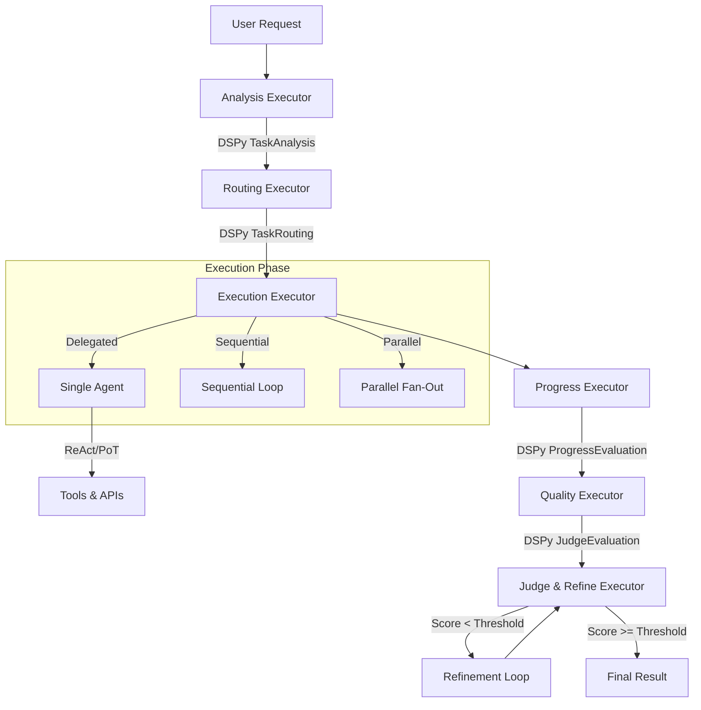

# AgenticFleet Synergy: DSPy + Microsoft Agent Framework

This document details the architectural synergy between **DSPy** (the "Brain") and **Microsoft Agent Framework** (the "Body") within AgenticFleet. This hybrid approach leverages the strengths of both systems to create a robust, intelligent, and type-safe agent orchestration platform.

## Core Philosophy: Brain & Body

- **The Brain (DSPy)**: Responsible for **cognitive tasks**. It handles unstructured reasoning, decision-making, planning, and quality assessment. It uses optimized prompts and signatures to extract structured intent from natural language.
- **The Body (Agent Framework)**: Responsible for **execution and orchestration**. It handles the reliable routing of messages, state management, tool invocation, and the graph-based workflow lifecycle.

## Architectural Flow

The workflow follows a pipeline where DSPy signals drive Agent Framework transitions.

## Integration Points

### 1. Task Analysis & Routing

- **Component**: `AnalysisExecutor` & `RoutingExecutor`
- **Synergy**: The `AnalysisExecutor` uses `DSPyReasoner.analyze_task` to decompose the user request. This structured analysis is passed to the `RoutingExecutor`, which uses `DSPyReasoner.route_task` to determine the `ExecutionMode` (Delegated, Sequential, Parallel) and the optimal agent roster.
- **Benefit**: Agent Framework doesn't need complex conditional logic in edges; it simply follows the structured `RoutingDecision` emitted by DSPy.

### 2. Execution & Tool Planning

- **Component**: `ExecutionExecutor`
- **Synergy**: Before executing a task, the executor calls `DSPyReasoner.decide_tools`. This generates a lightweight **ReAct-style plan** (e.g., "1. Search for X, 2. Analyze Y").
- **Benefit**: Agents (Executors) receive a "cognitive map" along with the task, reducing aimless tool usage and latency.

### 3. Autonomous Agents (ReAct / PoT)

- **Component**: `DSPyEnhancedAgent`
- **Synergy**: Inside the Agent Framework's `ChatAgent`, we inject DSPy modules (`FleetReAct`, `FleetPoT`).
  - **Researcher**: Uses `FleetReAct` to perform autonomous search-and-synthesize loops.
  - **Analyst**: Uses `FleetPoT` to write and execute Python code for precise calculations.
- **Benefit**: The "Body" (ChatAgent) gains specialized "Brain" capabilities without changing its external interface.

### 4. Quality & Refinement

- **Component**: `JudgeRefineExecutor`
- **Synergy**: This executor uses the `JudgeEvaluation` DSPy signature to score results against specific criteria. If the score is low, it triggers a **Refinement Loop** within the executor itself (or via workflow edges in future iterations).
- **Benefit**: Quality control is semantic and adaptive, not just a simple syntax check.

## Developer Guide

### Adding a New Capability

1.  **Define the Signature**: Create a new DSPy signature in `dspy_modules/signatures.py` (e.g., `SecurityAudit`).
2.  **Update the Brain**: Add a method to `DSPyReasoner` that uses this signature.
3.  **Update the Body**: Create or modify an Agent Framework `Executor` to call this new supervisor method and act on the result.

### Debugging Synergy

- **DSPy Issues**: Check `dspy_modules/` logs. If reasoning is poor, optimize the signature or provide better few-shot examples.
- **Workflow Issues**: Check `workflows/fleet/` logs. If the graph is stuck, check the `RoutingDecision` output from the supervisor.
